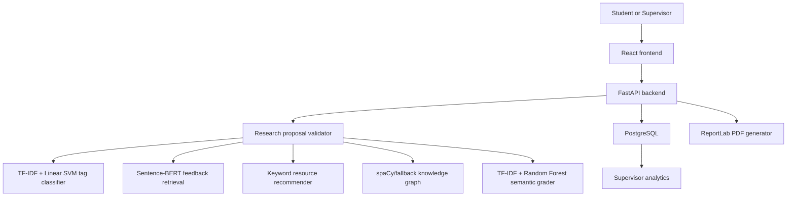

# Exposia AI Mentor

Exposia AI Mentor is a local full-stack research-proposal analysis system. It helps students and supervisors inspect exposé/proposal drafts, retrieve relevant reviewer feedback, recommend learning resources, build a lightweight concept graph, estimate semantic grading quality, and generate downloadable PDF feedback reports.

The project is implemented as a FastAPI backend, a Vite/React frontend, PostgreSQL runtime persistence, local CSV datasets, and serialized scikit-learn/Sentence-BERT model artifacts.

## Main Workflow



## Features

| Area | Implemented behavior |
| --- | --- |
| Proposal analysis | Validates research-proposal likeness, predicts annotation tag, retrieves similar feedback, recommends resources, and saves history. |
| PDF input | Frontend extracts PDF text with `pdfjs-dist` before calling the backend. |
| Semantic grading | Uses a local TF-IDF + Ridge regressor, deterministic section scoring, sufficiency-aware completeness scoring, and final readiness calculation. |
| Knowledge graph | Extracts concepts with spaCy when installed, otherwise uses a regex fallback; saves graph history. |
| Supervisor analytics | Aggregates local analysis and grading history into tag, resource, review, grade, completeness, and readiness summaries. |
| Report generation | Produces PDF feedback reports from analysis, graph, resource, and grading payloads. |
| Testing artifacts | Includes backend pipeline verification scripts and a Playwright UI smoke test. |

## Technology Stack

| Layer | Technology | Purpose |
| --- | --- | --- |
| Backend | FastAPI, Pydantic, Uvicorn | API endpoints, schema validation, CORS, static report serving. |
| ML / NLP | scikit-learn, sentence-transformers, numpy, pandas | Classification, semantic retrieval, semantic grading, dataset handling. |
| Optional NLP | spaCy `en_core_web_sm` | Higher quality concept extraction when locally installed. |
| PDF generation | ReportLab | Backend PDF feedback report creation. |
| Frontend | React 19, Vite, React Router | Single-page application and navigation. |
| Visualization | Recharts | Dashboard and analytics charts. |
| PDF parsing | `pdfjs-dist` | Browser-side PDF text extraction. |
| UI icons | `lucide-react` | Interface iconography. |
| Persistence | PostgreSQL, CSV, pickle files | Runtime histories/workflows, datasets, model artifacts, reports. |
| Testing | Playwright, custom Python verification scripts | UI smoke checks and training/inference checks. |

## Repository Map

| Path | Purpose |
| --- | --- |
| `app.py` | FastAPI application, endpoint models, inference orchestration, history persistence, analytics, report generation. |
| `frontend/` | Vite/React app with dashboard, analyzer, tracking, analytics, and history pages. |
| `processed/` | Modeling-ready datasets generated from raw Exposia exports. |
| `exposes/`, `reviews/` | Source corpus: submissions, annotations, comments, reviews, scores, LaTeX/PDF assets. |
| `models/` | Pickled local model/retrieval artifacts. |
| `backend/data/` | Legacy migration sources, migration reports/backups, and generated report artifacts. |
| `results/` | Model evaluations, audits, system test outputs, dataset lineage, and generated research evidence. |
| `reports/` | Generated PDF report output directory served by FastAPI. |
| `supplementary/` | Criteria/configuration/reference data used by dataset and review tooling. |

## API Surface

| Method | Path | Purpose |
| --- | --- | --- |
| `GET` | `/` | Backend health message. |
| `POST` | `/analyze` | Full analysis pipeline: validation, tag prediction, feedback retrieval, recommendations, history save. |
| `POST` | `/predict-weakness` | Tag-only prediction. |
| `POST` | `/generate-feedback` | Retrieval-only feedback matching. |
| `POST` | `/recommend-resources` | Resource recommendation for proposal weakness/feedback text. |
| `POST` | `/knowledge-graph` | Concept extraction, edge generation, missing-concept detection. |
| `POST` | `/grade-report` | Semantic grade, section scores, completeness, and final readiness. |
| `POST` | `/generate-report` | PDF report generation. |
| `GET` | `/analysis-history` | Newest analysis records. |
| `DELETE` | `/analysis-history` | Clear all analysis records. |
| `DELETE` | `/analysis-history/{analysis_id}` | Delete one analysis record. |
| `GET` | `/knowledge-graph-history` | Newest graph records. |
| `GET` | `/grading-history` | Newest grading records. |
| `DELETE` | `/grading-history` | Clear grading records. |
| `GET` | `/grading-analytics` | Aggregated semantic grading metrics. |
| `GET` | `/supervisor-analytics` | Aggregated proposal-analysis metrics. |

## Datasets and Models

| Artifact | Rows / role |
| --- | --- |
| `processed/exposia_annotations.csv` | 2,228 annotation rows. |
| `processed/exposia_comments.csv` | 2,253 reviewer comment rows. |
| `processed/exposia_grading_dataset.csv` | 165 grading records. |
| `processed/exposia_reports.csv` | 55 report pairs. |
| `processed/weakness_dataset_final.csv` | 2,035 finalized classification rows. |
| `processed/feedback_dataset_final.csv` | 2,134 retrieval rows. |
| `models/weakness_svm_model.pkl` | Production tag classifier. |
| `models/feedback_embeddings.pkl` | Sentence-BERT retrieval index. |
| `models/semantic_grading_model.pkl` | Production semantic grading regressor. |

Current saved metrics include TF-IDF + Linear SVM accuracy `0.4545`, macro F1 `0.2891`, and weighted F1 `0.4461`; Sentence-BERT + logistic regression accuracy `0.3498`; and semantic grading grouped holdout MAE `5.6585`, RMSE `7.1283`, R2 `0.2280`.

## Quick Start

```powershell
python -m venv venv
venv\Scripts\pip install -r requirements.txt
Copy-Item .env.example .env
Set-Location backend
alembic upgrade head
.\start_backend.ps1
```

In another terminal:

```powershell
Set-Location frontend
npm install
npm run dev
```

Open `http://127.0.0.1:5173`. The backend defaults to `http://127.0.0.1:9000`.

## Documentation

Detailed reverse-engineered documentation is in:

- [docs/README.md](docs/README.md)
- [docs/architecture.md](docs/architecture.md)
- [docs/api.md](docs/api.md)
- [docs/database.md](docs/database.md)
- [docs/machine-learning.md](docs/machine-learning.md)
- [docs/deployment.md](docs/deployment.md)
- [docs/development.md](docs/development.md)
- [docs/security.md](docs/security.md)
- [docs/troubleshooting.md](docs/troubleshooting.md)

## Known Limitations

- Pickle artifacts are trusted local files and must not be loaded from untrusted sources.
- PostgreSQL must be available and migrated before database-backed APIs can run.
- Some legacy data/results may contain corrupted-history backups from prior runtime recovery.
- Semantic grading is explicitly a supportive baseline estimate, not an authoritative academic grade.

