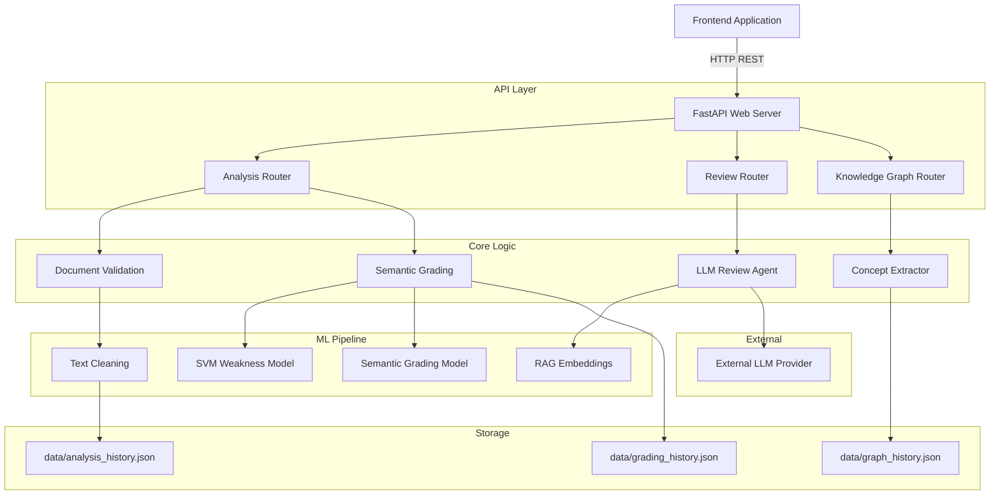
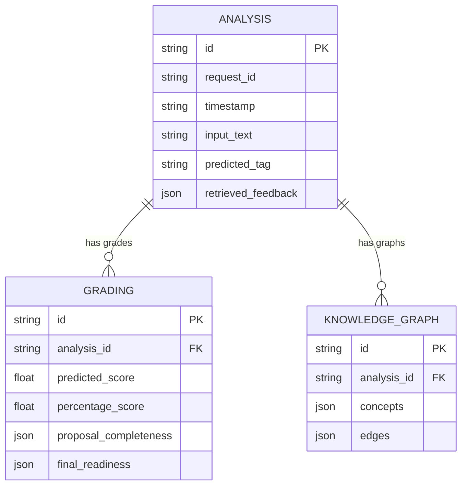
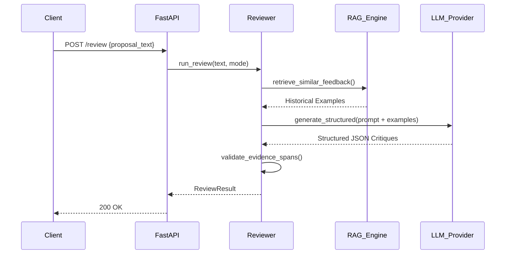
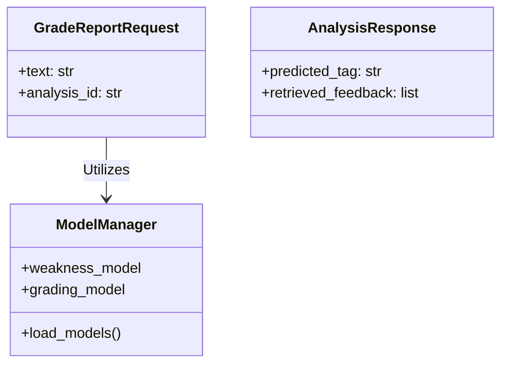

# Exposia AI Backend Documentation

Welcome to the **Exposia AI Backend**! This documentation is designed to comprehensively cover every aspect of the backend system. Whether you are a new engineer joining the team, an architect reviewing the structure, or an ML engineer looking into our model pipelines, this guide covers everything.

---

## Table of Contents

1. [Project Overview](#1-project-overview)
2. [Technology Stack](#2-technology-stack)
3. [System Architecture](#3-system-architecture)
4. [Folder Structure](#4-folder-structure)
5. [Configuration](#5-configuration)
6. [Database Documentation](#6-database-documentation)
7. [API Documentation](#7-api-documentation)
8. [Authentication & Authorization](#8-authentication--authorization)
9. [Machine Learning Documentation](#9-machine-learning-documentation)
10. [Dataset Documentation](#10-dataset-documentation)
11. [Business Logic](#11-business-logic)
12. [Design Patterns](#12-design-patterns)
13. [External Services](#13-external-services)
14. [Data Flow](#14-data-flow)
15. [Error Handling](#15-error-handling)
16. [Performance](#16-performance)
17. [Security](#17-security)
18. [Deployment](#18-deployment)
19. [How to Run](#19-how-to-run)
20. [Testing](#20-testing)
21. [Known Limitations](#21-known-limitations)
22. [Future Improvements](#22-future-improvements)
23. [Sequence Diagrams](#23-sequence-diagrams)
24. [Architecture Diagram](#24-architecture-diagram)
25. [ER Diagram](#25-er-diagram)
26. [Component Diagram](#26-component-diagram)
27. [Class Diagram](#27-class-diagram)
28. [Glossary](#28-glossary)
29. [Developer Notes](#29-developer-notes)
30. [Conclusion](#30-conclusion)

---

## 1. Project Overview

### What problem does this project solve?
Exposia AI is an autonomous academic proposal review and mentorship platform. It replaces or supplements the manual academic supervisor review process by automatically analyzing student research proposals. It assesses semantic quality, structural completeness, identifies weaknesses, suggests historical feedback, and generates knowledge graphs of core concepts.

### Intended Users
- **Students / Researchers**: Receive instant, actionable feedback and AI-driven grades on their research proposals.
- **Supervisors / Academics**: Access aggregated analytics on student cohorts, reducing the manual burden of grading initial proposal drafts.

### High-level Workflow
1. A student submits a research proposal text or PDF.
2. The system cleans and validates the text to ensure it resembles an academic document.
3. The pipeline assesses structure (Abstract, Methodology, etc.).
4. ML models predict weaknesses and calculate a baseline "Semantic Grade" (0-42).
5. RAG (Retrieval-Augmented Generation) pulls in similar historical feedback from past annotations.
6. The system combines these scores into a "Final Readiness" assessment.
7. Advanced autonomous LLM reviews can provide deeper contextual critiques.

---

## 2. Technology Stack

| Technology | Role | Why it was chosen |
| :--- | :--- | :--- |
| **Python 3** | Core Language | Industry standard for Machine Learning and backend data processing. |
| **FastAPI** | Web Framework | Extremely fast, async-native, built-in data validation (Pydantic), and automatic OpenAPI documentation. |
| **Uvicorn** | ASGI Server | High-performance async server for FastAPI. |
| **Scikit-Learn** | ML Framework | Used for the `weakness_svm_model.pkl` to efficiently classify text weaknesses. |
| **SentenceTransformers** | Embeddings | Used to generate dense vectors for semantic RAG retrieval (`feedback_embeddings.pkl`). |
| **PyTorch / Transformers** | Deep Learning | Underlying requirement for running sentence-transformers and local NLP inferences. |
| **Pydantic** | Validation | Strong static typing and data validation for all API inputs and outputs. |
| **OpenAI / LLM APIs** | Generative AI | Powers the autonomous contextual review (`src/reviewer`). |
| **Pytest** | Testing | Standard, robust testing framework for Python. |

---

## 3. System Architecture

The system follows a modern decoupled API approach with embedded ML inference pipelines.



### Flow Descriptions
- **Request Flow**: Requests hit Uvicorn -> FastAPI -> specific Router -> `core_logic.py` services.
- **Response Flow**: Services return Pydantic models -> Router converts to JSON -> FastAPI responds.
- **Data Flow**: Ephemeral data is processed in memory. ML features are extracted, passed to loaded `.pkl` models. Results are persisted to local `.json` files for history.

---

## 4. Folder Structure

```
backend/
├── data/                    # JSON data stores (database alternative)
├── docs/                    # Architecture and developer documentation
├── logs/                    # Application and error logs
├── models/                  # ML models (.pkl files) - mapped via .env MODEL_DIR
├── prompts/                 # System and user prompt templates for LLMs
├── reports/                 # Statically served generated PDF reports
├── scripts/                 # Utility shell scripts
├── src/
│   ├── api/                 # FastAPI configuration, dependencies, and routers
│   ├── core/                # Core business logic, validation, embeddings handling
│   ├── exposia/             # Data domain processing and dataset logic
│   └── reviewer/            # Autonomous LLM review pipeline and RAG logic
├── tests/                   # Pytest test suite
├── .env.example             # Template for environment variables
├── pyproject.toml           # Modern Python packaging configuration
├── requirements.txt         # Explicit pip dependencies
└── start_backend.sh/.ps1    # Bash/PowerShell entry point scripts
```

---

## 5. Configuration

Configuration is managed via `.env` files and `Pydantic` Settings.

| Variable | Default | Purpose |
| :--- | :--- | :--- |
| `APP_ENV` | `development` | Sets application mode (dev/prod). |
| `APP_HOST` | `127.0.0.1` | Binding interface for Uvicorn. |
| `APP_PORT` | `9000` | Port for the backend API. |
| `MODEL_DIR` | `../training/models` | Absolute or relative path to ML `.pkl` artifacts. |
| `DATA_DIR` | `data` | Directory to store JSON history databases. |
| `ALLOWED_ORIGINS` | `http://localhost:5173` | CORS allowed origins for frontend connections. |

**Dependency Management:**
Dependencies are locked using `requirements.txt`. The project also features a `pyproject.toml` for standard module resolution (`src.*`).

---

## 6. Database Documentation

The system currently relies on flat-file JSON stores located in the `DATA_DIR` instead of a relational database. This is a deliberate choice for portability in early versions.

### Entities

1. **Analysis History (`analysis_history.json`)**
   - Stores raw text, student metadata, predicted tags, and RAG feedback.
2. **Grading History (`grading_history.json`)**
   - Stores numeric scores, readiness percentages, and completeness breakdowns.
3. **Graph History (`graph_history.json`)**
   - Stores extracted knowledge graph nodes and edges.

### ER Diagram



---

## 7. API Documentation

*Base URL: `http://localhost:9000`*

### **POST `/predict-weakness`**
- **Purpose**: Predicts the major weakness category of a text using the SVM.
- **Body**: `{ "text": "research proposal content..." }`
- **Response**: `{ "predicted_tag": "Methodology Lack" }`

### **POST `/grade-report`**
- **Purpose**: Generates a baseline semantic grading estimate for full proposal text.
- **Body**: `GradeReportRequest`
- **Response**: Returns predicted score out of 42, percentage, semantic label, and completion metrics.

### **POST `/analyze`**
- **Purpose**: Holistic run: Predicts weakness, retrieves RAG feedback, and recommends resources.
- **Body**: `AnalyzeRequest`
- **Response**: `AnalysisResponse` containing feedback, tags, and resources.

### **POST `/review`**
- **Purpose**: Executes the heavy LLM autonomous review.
- **Body**: `{ "proposal_text": "...", "mode": "llm_rag_criteria" }`
- **Response**: Granular criteria critiques and overall summary.

### **GET `/supervisor-analytics`**
- **Purpose**: Returns aggregated statistics on cohort weaknesses, readiness, and score trends.
- **Response**: `SupervisorAnalyticsResponse`

---

## 8. Authentication & Authorization

Currently, the backend runs in a highly decoupled, stateless mode with **no active Authentication or Authorization middleware**.
- All endpoints are public.
- CORS is restricted via `ALLOWED_ORIGINS` to prevent unauthorized cross-origin browser access, but direct API access is unrestrained.
- *Note: Auth implementations (JWT/OAuth) are listed in Future Improvements.*

---

## 9. Machine Learning Documentation

The project relies on multiple ML models loaded lazily into memory via the `ModelManager`.

### 1. Weakness Predictor (`weakness_svm_model.pkl`)
- **Type**: Support Vector Machine (Scikit-Learn).
- **Purpose**: Classifies a text snippet into a predefined weakness category (e.g., "Weak Methodology", "Vague Abstract").
- **Features**: TF-IDF vectorized n-grams.

### 2. Semantic Grader (`semantic_grading_model.pkl`)
- **Purpose**: Outputs a continuous score (0-42) based on academic phrasing, density, and structure.

### 3. RAG Embeddings (`feedback_embeddings.pkl`)
- **Architecture**: SentenceTransformers (HuggingFace).
- **Purpose**: Converts text to dense vectors. Uses Cosine Similarity to find the nearest neighbor historical feedback annotations.
- **Inference**: Loaded globally. Uses `cosine_similarity` from `sklearn`.

---

## 10. Dataset Documentation

The system is trained on the **Exposia 1.0.0 Dataset**, an internal corpus of academic research proposals, annotations, and supervisor feedback.
- **Preprocessing**: Managed by scripts in `../training/scripts/`. Text is cleaned, normalized, and stripped of non-academic noise (e.g., source code, receipts).
- **Labels**: Annotations are mapped to specific structural flaws.

---

## 11. Business Logic

The core logic resides in `src/api/services/core_logic.py` and `src/core/`.

- **Validation Gate**: Before ML inference, text must pass `validate_research_proposal_text`. If the text contains terms like "invoice" or "source code" or lacks "research", "aim", "methodology", the system rejects it.
- **Hybrid Readiness Score**:
  - The AI provides a *Semantic Percentage*.
  - The parser provides a *Completeness Percentage* based on sections and word counts.
  - `Final Readiness = (0.70 * Semantic) + (0.30 * Completeness)`.
  - A *Readiness Gate* applies: If completeness is < 40%, the proposal is unconditionally labeled "Incomplete Proposal", regardless of semantic brilliance.

---

## 12. Design Patterns

- **Singleton Pattern (ModelManager)**: ML models are large. They are loaded once globally in `dependencies.py` to prevent memory blowouts.
- **Factory/Provider Pattern**: `get_llm_provider()` in the reviewer isolates the external LLM vendor logic from the main application.
- **Strategy Pattern**: The `/review` endpoint dynamically alters its behavior based on `mode` (e.g., `llm_only` vs `llm_rag_criteria`).

---

## 13. External Services

- **OpenAI (or equivalent LLM)**: Used for generative feedback in the `/review` endpoint. The integration occurs via `src/reviewer/providers.py` which interfaces with external REST endpoints to stream LLM responses.

---

## 14. Data Flow

1. **User Action**: Student clicks "Analyze Proposal".
2. **Ingestion**: Frontend sends text to `/analyze`.
3. **Validation**: Text is scrubbed of HTML and validated.
4. **Embedding**: Text is vectorized via `SentenceTransformers`.
5. **RAG**: Vector is compared to `feedback_embeddings.pkl` using Cosine Similarity.
6. **Inference**: Text is passed to the SVM model for tagging.
7. **Persistence**: The combined output is saved to `analysis_history.json`.
8. **Response**: FastAPI serializes data to JSON and returns to the client.

---

## 15. Error Handling

- **Validation Errors**: FastAPI/Pydantic automatically returns `422 Unprocessable Entity` for invalid payloads.
- **Business Rule Errors**: Invalid documents (e.g., pasting code) raise an `HTTPException(400)` with a clear message.
- **Corruption Recovery**: If `history.json` is corrupted, the backend catches the `JSONDecodeError`, backs up the file to `.corrupted.json`, and initializes a fresh array.
- **Missing Models**: If a `.pkl` is missing on startup, the system issues a warning but allows the server to boot (failing gracefully when endpoints are hit).

---

## 16. Performance

- **Lazy Loading**: Models are not loaded on startup, reducing initial boot time. They are loaded on the first API request.
- **Vector Operations**: Matrix math (cosine similarity) relies on NumPy's highly optimized C backend.
- **Storage Bottleneck**: Appending to a flat JSON file requires reading and re-writing the entire array, which is an `O(N)` operation that will degrade as history grows.

---

## 17. Security

- **CORS Mitigation**: Controlled via the `ALLOWED_ORIGINS` env variable.
- **Path Traversal Protection**: File paths are strictly joined against `ROOT_DIR`.
- **Data Scrubbing**: XSS risks are mitigated via `xml.sax.saxutils.escape` during text processing.

---

## 18. Deployment

The backend is built for simple Docker or Bare-metal deployment.
- Start scripts (`start_backend.sh`, `start_backend.ps1`) handle environment injection and Uvicorn orchestration.
- Output logs are redirected to `logs/backend.combined.log`.
- Designed to sit behind an NGINX reverse proxy in production.

---

## 19. How to Run

1. **Clone the Repository**.
2. **Set up Virtual Environment**:
   ```bash
   python3 -m venv venv
   source venv/bin/activate
   ```
3. **Install Dependencies**:
   ```bash
   pip install -r requirements.txt
   ```
4. **Ensure Models Exist**: Ensure your `.pkl` artifacts are located in `../training/models/`.
5. **Configure Environment**: Copy `.env.example` to `.env`.
6. **Run**:
   ```bash
   ./start_backend.sh
   # Or on Windows: .\start_backend.ps1
   ```
7. **Access Docs**: Navigate to `http://localhost:9000/docs` to see the Swagger UI.

---

## 20. Testing

- The test suite is located in the `tests/` directory.
- Execute tests using Pytest:
  ```bash
  pytest tests/
  ```
- Focuses on validation logic (`test_evidence_validation.py`), schema compliance (`test_llm_schema.py`), and scoring integrity.

---

## 21. Known Limitations

- **File-based DB**: Reading/writing large JSON arrays is inefficient and not thread-safe under high concurrency.
- **Model Ram**: Keeping transformers in RAM limits parallel scaling without dedicated GPU instances.
- **Statelessness**: Without user sessions, all analysis history is global.

---

## 22. Future Improvements

1. **Database Migration**: Migrate from JSON files to PostgreSQL for transactional safety.
2. **Vector Database**: Migrate the NumPy cosine similarity logic to ChromaDB or Pinecone for scalable RAG retrieval.
3. **Authentication Setup**: Introduce JWT Middleware to isolate student data.
4. **Async ML Inference**: Offload heavy inference tasks to a Celery/Redis queue instead of blocking the FastAPI thread.

---

## 23. Sequence Diagrams

### Autonomous Review Flow



---

## 24. Architecture Diagram

See [Section 3](#3-system-architecture).

---

## 25. ER Diagram

See [Section 6](#6-database-documentation).

---

## 26. Component Diagram

```mermaid
componentDiagram
    package "FastAPI Application" {
        [Routers] --> [Core Services]
        [Core Services] --> [Model Manager]
        [Core Services] --> [History Storage]
    }
    
    package "ML Artifacts" {
        [Model Manager] --> [weakness_svm_model.pkl]
        [Model Manager] --> [semantic_grading_model.pkl]
        [Model Manager] --> [feedback_embeddings.pkl]
    }
```

---

## 27. Class Diagram



---

## 28. Glossary

- **Semantic Grading**: AI-estimated score evaluating academic tone and structure.
- **Proposal Completeness**: A deterministic check verifying if required sections (Abstract, Methodology) exist and meet word counts.
- **Final Readiness**: A hybrid score weighting Semantic logic (70%) and Completeness (30%).
- **Knowledge Graph**: A node-edge representation mapping the relationships between concepts in the text.
- **RAG**: Retrieval-Augmented Generation.

---

## 29. Developer Notes

- **Lazy Loading Side Effects**: The first request to `/predict-weakness` or `/grade-report` will take significantly longer as `pickle` deserializes the large model artifacts into RAM.
- **Missing Models**: If you encounter a `FileNotFoundError` on startup, you must run the training scripts in the `training` repository to generate the `.pkl` files and place them in the configured `MODEL_DIR`.

---

## 30. Conclusion

The Exposia AI Backend is a powerful synthesis of standard web API architecture and advanced applied Machine Learning. It processes complex academic documents through rigorous deterministic validation gates before passing them into a suite of statistical and neural models. By orchestrating everything through a robust FastAPI layer, the system remains fast, strongly typed, and easily extensible for future iterations of autonomous mentorship capabilities.
