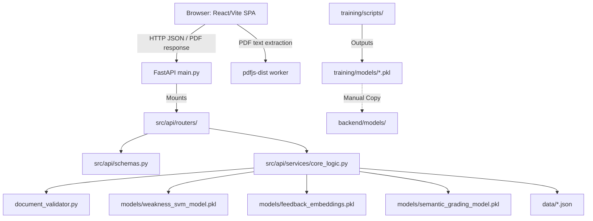
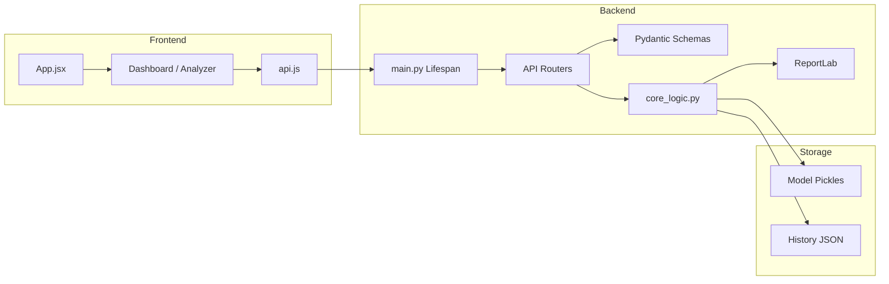

# System Architecture

## High-Level Architecture

## Component Diagram

## Request Flow

1. The user opens the React SPA from Vite.
2. `frontend/src/api.js` targets `VITE_API_BASE_URL` or `http://127.0.0.1:9000`.
3. The frontend sends JSON to modular endpoints like `/analyze`, `/knowledge-graph`, or `/grade-report`.
4. `src/api/main.py` receives the request and routes it to the appropriate file in `src/api/routers/`.
5. The router validates the payload against `src/api/schemas.py`.
6. Business logic is executed via `src/api/services/core_logic.py` (which handles model inference, document validation, and history persistence).
7. The router returns the serialized JSON or PDF bytes to the frontend.

## Design Patterns

| Pattern | Where | Why it exists |
| --- | --- | --- |
| API Routers | `src/api/routers/` | Prevents the API from turning into an unmaintainable monolith. |
| Schema Centralization | `src/api/schemas.py` | Prevents circular dependencies between routers and services. |
| Core Service Layer | `src/api/services/core_logic.py` | Keeps API controllers lean by housing complex PDF and ML logic elsewhere. |
| Lifespan Management | `main.py` | Loads heavy ML models into memory exactly once at application startup. |
| Physical Environment Isolation | `backend/` vs `training/` | Prevents ML training dependencies (Jupyter, Pandas) and raw datasets from bloating the live server deployment. |
