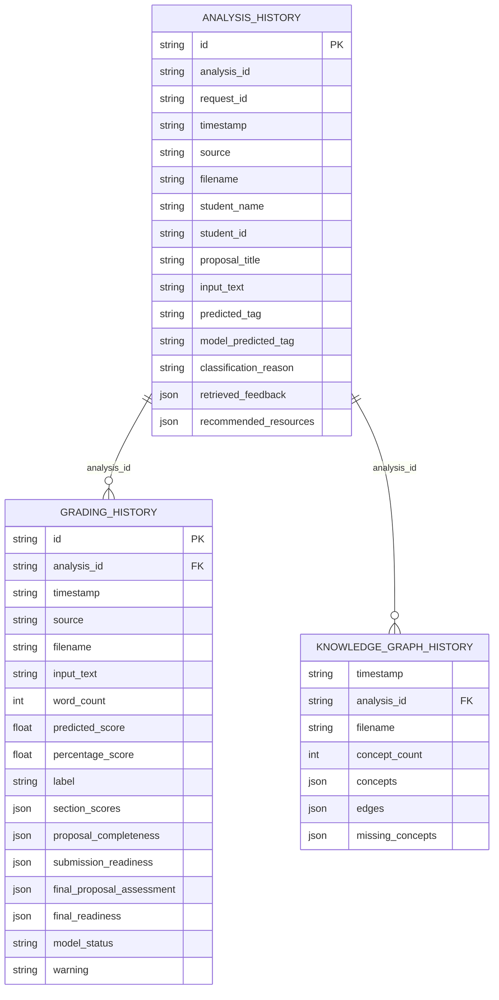
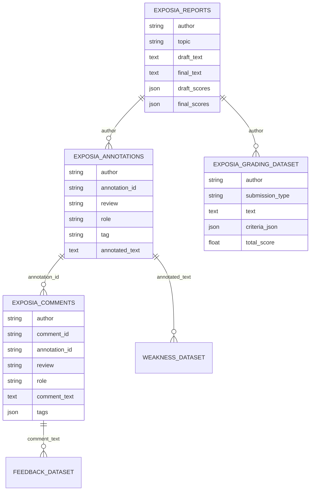

# Database and Persistence Documentation

## Summary

No SQL database is implemented. There is no ORM, schema migration framework, database connection pool, indexes, or foreign-key enforcement. Persistence is file-based:

- Runtime history: JSON files in `data/`
- Processed datasets: CSV files in `processed/`
- Model artifacts: pickle files in `models/`
- Generated reports: PDF files in `reports/`

The “database” documentation below describes the effective data stores that the application actually reads and writes.

## Runtime JSON Stores

| File | Written by | Read by | Purpose |
| --- | --- | --- | --- |
| `data/analysis_history.json` | `/analyze`, delete/clear helpers | history, dashboard, supervisor analytics, report generation | Successful proposal analysis records. |
| `data/grading_history.json` | `/grade-report`, clear helper | grading history, grading analytics, report generation | Semantic grading and readiness records. |
| `data/knowledge_graph_history.json` | `/knowledge-graph` | graph history, dashboard/history matching | Knowledge graph summaries. |
| `data/*.corrupted.json` | corruption recovery logic | not used by normal app flow | Backup of invalid JSON detected at runtime. |

## Runtime Store ER Diagram

This diagram shows logical relationships by shared IDs. They are not database-enforced foreign keys.

## Processed Dataset Schemas

| File | Rows | Columns | Purpose |
| --- | ---: | --- | --- |
| `processed/exposia_annotations.csv` | 2,228 | `author`, `annotation_id`, `review`, `role`, `tag`, `annotated_text` | Base annotation corpus. |
| `processed/exposia_comments.csv` | 2,253 | `author`, `comment_id`, `annotation_id`, `review`, `role`, `comment_text`, `tags` | Reviewer comments linked to annotations. |
| `processed/exposia_grading_dataset.csv` | 165 | `author`, `submission_type`, `text`, `criteria_json`, `total_score` | Semantic grading model input/target rows. |
| `processed/exposia_reports.csv` | 55 | `author`, `topic`, `draft_text`, `final_text`, `draft_scores`, `final_scores` | Draft/final proposal corpus. |
| `processed/feedback_dataset.csv` | 2,152 | `annotated_text`, `tag`, `comment_text` | Initial retrieval dataset. |
| `processed/feedback_dataset_final.csv` | 2,134 | `annotated_text`, `tag`, `comment_text` | Final retrieval dataset. |
| `processed/weakness_dataset.csv` | 2,227 | `annotated_text`, `tag` | Initial classification dataset. |
| `processed/weakness_dataset_final.csv` | 2,035 | `annotated_text`, `tag` | Final production classification dataset. |
| `processed/weakness_dataset_labelclean_experimental.csv` | 1,913 | `annotated_text`, `tag` | Experimental label-cleaned classifier dataset. |

## Processed Dataset ER Diagram

## Keys, Relationships, and Constraints

| Concept | Implemented? | Notes |
| --- | --- | --- |
| Primary keys | Partially | Runtime history records have generated `id` fields; CSV datasets do not enforce uniqueness. |
| Foreign keys | Logical only | `analysis_id` links analysis, graph, and grading histories when supplied. |
| Indexes | No | Files are loaded and scanned in memory. |
| Constraints | Application-level | Validation is performed by Python/Pydantic and dataset scripts. |
| Migrations | No | Schema changes are handled by code-level normalization of legacy fields. |
| Normalization | Partial | Processed datasets separate reports, annotations, comments, and grading rows; runtime JSON records duplicate denormalized data for convenience. |

## Migration History

No formal migration history exists. The code contains compatibility helpers such as legacy field normalization for report payloads and grading/completeness payloads, and JSON corruption recovery that backs up invalid history files with `.corrupted.json`.

