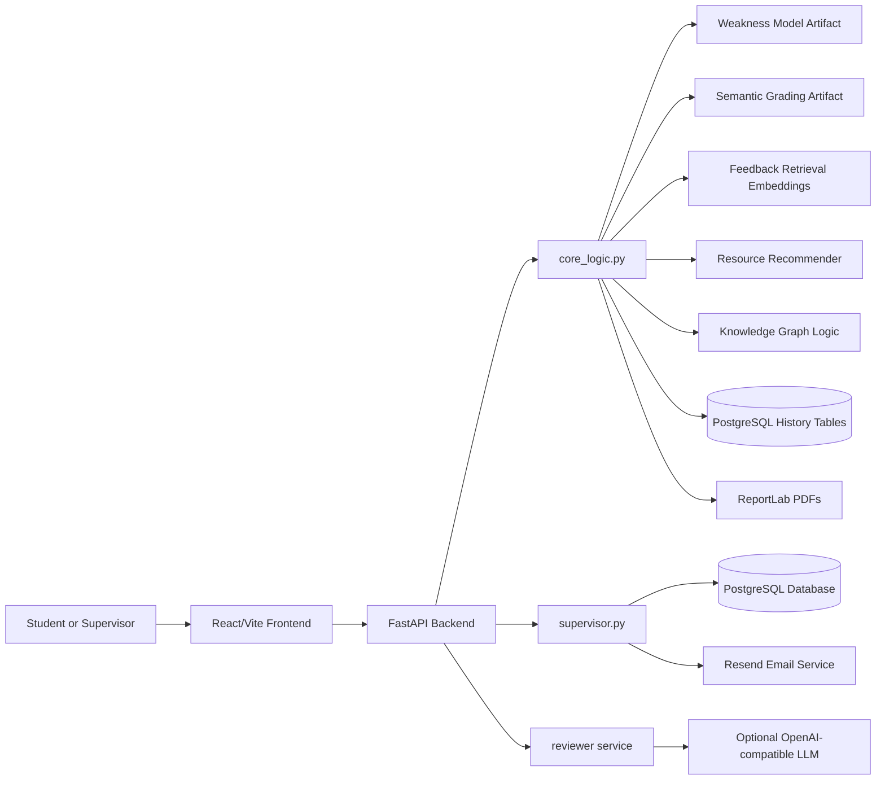
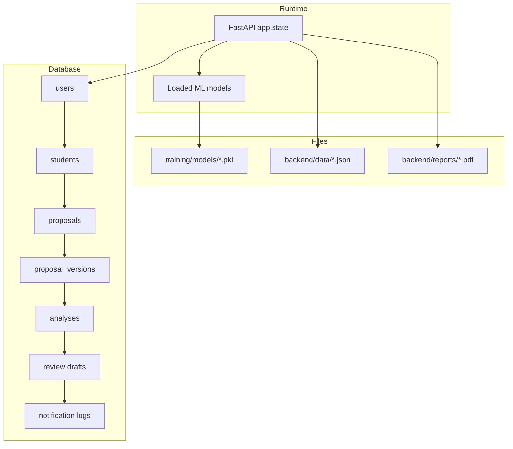
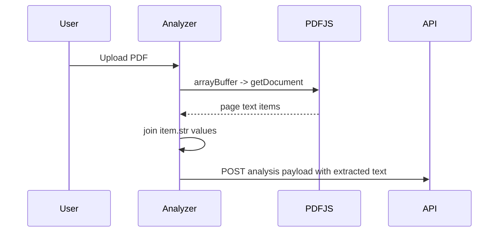
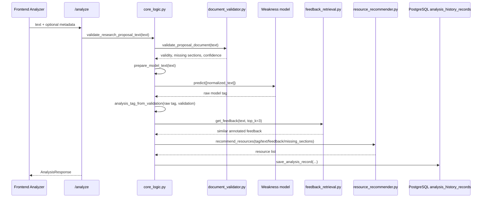
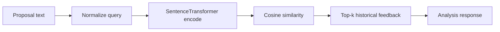
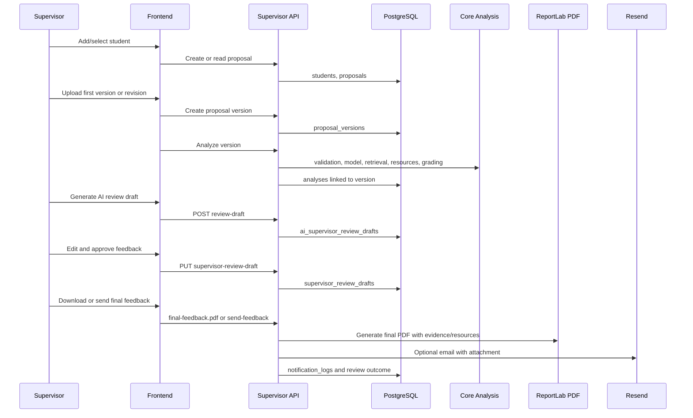
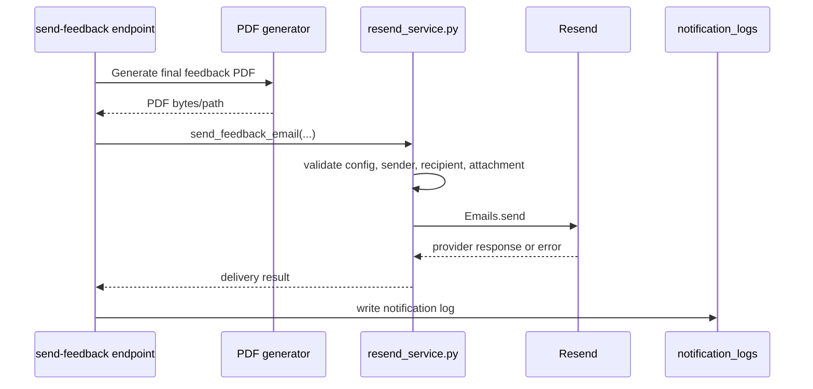

# ResearchPilot Technical Learning Guide

This guide explains the current ResearchPilot repository as it exists in code, tests, artifacts, and local documentation. It is written for a developer or project evaluator who wants to understand the system end to end: what is implemented, how data moves, what the machine learning artifacts do, where the supervisor workflow stores evidence, and which parts are still prototype-grade.

Important source-of-truth note: several older docs and reports describe earlier designs. The current runtime code and deployed model artifacts are authoritative. Where old documentation disagrees with runtime behavior, this guide calls that out.

## Table of Contents

1. [Purpose and Reading Strategy](#1-purpose-and-reading-strategy)
2. [Executive Summary](#2-executive-summary)
3. [Current Architecture](#3-current-architecture)
4. [Repository Map](#4-repository-map)
5. [Application Startup and Configuration](#5-application-startup-and-configuration)
6. [Frontend Architecture](#6-frontend-architecture)
7. [Backend API Reference](#7-backend-api-reference)
8. [Complete Proposal Analysis Trace](#8-complete-proposal-analysis-trace)
9. [Document Validation and Completeness Logic](#9-document-validation-and-completeness-logic)
10. [Weakness Classification Model](#10-weakness-classification-model)
11. [Feedback Retrieval System](#11-feedback-retrieval-system)
12. [Learning Resource Recommendation](#12-learning-resource-recommendation)
13. [Semantic Grading Model](#13-semantic-grading-model)
14. [Section Scores, Completeness, and Readiness](#14-section-scores-completeness-and-readiness)
15. [Knowledge Graph Generation](#15-knowledge-graph-generation)
16. [Autonomous LLM Review](#16-autonomous-llm-review)
17. [Supervisor Review Workflow](#17-supervisor-review-workflow)
18. [Database and Persistence Model](#18-database-and-persistence-model)
19. [PDF Report Generation and Clickable Resources](#19-pdf-report-generation-and-clickable-resources)
20. [Email Delivery with Resend](#20-email-delivery-with-resend)
21. [Improvement Tracking Across Versions](#21-improvement-tracking-across-versions)
22. [Authentication, Authorization, and Security](#22-authentication-authorization-and-security)
23. [Testing and Verification](#23-testing-and-verification)
24. [Proposal Feature Alignment](#24-proposal-feature-alignment)
25. [Known Bugs, Limitations, and Technical Debt](#25-known-bugs-limitations-and-technical-debt)
26. [Demonstration Guide](#26-demonstration-guide)
27. [Viva Preparation](#27-viva-preparation)
28. [VS Code Learning Plan](#28-vs-code-learning-plan)
29. [Glossary](#29-glossary)
30. [Current Status and Next Actions](#30-current-status-and-next-actions)

---

## 1. Purpose and Reading Strategy

ResearchPilot is a local academic proposal review system. It combines a React frontend, a FastAPI backend, local machine learning artifacts, PostgreSQL runtime persistence, PDF generation, optional email delivery, and optional LLM-based review.

Use this guide in three passes:

| Pass | Goal | Best sections |
| --- | --- | --- |
| First pass | Understand the product and major flows | Sections 2, 3, 8, 17, 26 |
| Developer pass | Learn the code paths and data contracts | Sections 4-7, 18-21 |
| Viva pass | Prepare explanations, limitations, and defense answers | Sections 10-16, 22-30 |

Recommended first file to open in VS Code: `backend/src/api/routers/analysis.py`. It is the shortest path into the core analysis behavior and shows how the public API calls the model, retrieval, recommendations, grading, reports, and history.

---

## 2. Executive Summary

ResearchPilot currently works as a standalone local review application. It is not yet integrated with a parent IPMS system through SSO, APIs, webhooks, or production deployment. The codebase does, however, implement a realistic supervisor workflow around students, proposals, versions, AI-assisted analysis, editable supervisor feedback drafts, final PDF feedback, email delivery logs, and improvement tracking.

### Current Implementation Snapshot

| Area | Current status |
| --- | --- |
| Frontend | React + Vite application in `frontend/` |
| Backend | FastAPI application in `backend/src/api/` |
| Main API entry | `backend/src/api/main.py` |
| Core analysis logic | `backend/src/api/services/core_logic.py` |
| Supervisor workflow | `backend/src/api/routers/supervisor.py` |
| Local database | PostgreSQL configured by `DATABASE_URL` |
| Legacy histories | JSON files under configured `DATA_DIR` |
| Weakness model artifact | `training/models/weakness_svm_model.pkl` |
| Deployed weakness model type | `SemanticTransformer` + `LogisticRegression` pipeline |
| Grading model artifact | `training/models/semantic_grading_model.pkl` |
| Deployed grading model type | `TfidfVectorizer` + `Ridge` pipeline |
| Retrieval artifact | `training/models/feedback_embeddings.pkl` |
| Retrieval embedding model | `all-MiniLM-L6-v2` |
| PDF generation | ReportLab in `core_logic.py` |
| Email delivery | Optional Resend integration in `backend/src/api/services/resend_service.py` |
| Parent IPMS integration | Not implemented in current repository |
| Production readiness | Prototype/local-demo level, not production hardened |

### Most Important Reality Checks

1. The old README says there is no SQL database, no authentication, no cloud, and no email. Current code has PostgreSQL, cookie authentication, Resend email support, and supervisor workflow tables.
2. The artifact name `weakness_svm_model.pkl` is misleading. The deployed object is a scikit-learn pipeline with `SemanticTransformer` and `LogisticRegression`.
3. The old training report describes a TF-IDF + LinearSVC weakness classifier and a RandomForest grading model. Current deployed artifacts differ.
4. LLM RAG support exists, but `backend/src/reviewer/retrieval.py` expects a CSV path that is not present in the current repository layout.
5. Frontend authentication is currently bypassed for development through flags in `frontend/src/App.jsx`.
6. The supervisor final feedback PDF path now has resource propagation support in current code, including clickable valid HTTP/HTTPS links.

---

## 3. Current Architecture

### High-Level System



### Storage Boundaries



### Main Design Pattern

The application uses a pragmatic service-router split:

| Layer | Main files | Responsibility |
| --- | --- | --- |
| Frontend pages | `frontend/src/pages/*.jsx` | User workflows, form state, PDF extraction, routing |
| Frontend API client | `frontend/src/api.js` | HTTP wrapper around backend endpoints |
| API routers | `backend/src/api/routers/*.py` | Request validation, endpoint orchestration |
| Service logic | `backend/src/api/services/*.py` | Shared business workflows |
| Core ML/retrieval | `backend/src/core/*.py` | Model inference, validation, retrieval, graph logic |
| Reviewer service | `backend/src/reviewer/*.py` | LLM prompts, provider abstraction, schema validation |
| Database layer | `backend/src/db/*.py` | PostgreSQL schema and repository helpers |
| Training/data | `training/`, `backend/src/exposia/` | Dataset preparation, experiments, artifacts |

---

## 4. Repository Map

### Top-Level Areas

| Path | Purpose |
| --- | --- |
| `backend/` | FastAPI application, core ML code, database schema, tests, reports, data histories |
| `frontend/` | React/Vite client application |
| `training/` | Processed datasets, model artifacts, training scripts, experiment outputs |
| `experiments/` | Supporting experimental material |
| `backend/docs/` | Existing backend-specific documentation |
| `docs/RESEARCHPILOT_TECHNICAL_GUIDE.md` | This guide |

### Backend Files to Know First

| Path | Why it matters |
| --- | --- |
| `backend/src/api/main.py` | Creates the FastAPI app, loads models, initializes configured DB, mounts routers |
| `backend/src/api/routers/analysis.py` | Public analysis, grading, feedback, report generation endpoints |
| `backend/src/api/routers/supervisor.py` | Student/proposal/version/review/final feedback workflow |
| `backend/src/api/services/core_logic.py` | Central orchestration for validation, prediction, retrieval, grading, history, PDF reports |
| `backend/src/api/services/improvement_tracking.py` | Version comparison and best-version selection |
| `backend/src/api/services/resend_service.py` | Optional email delivery through Resend |
| `backend/src/api/auth.py` | Cookie sessions, password hashing, supervisor identity |
| `backend/src/db/session.py` | SQLAlchemy session setup from `DATABASE_URL` |
| `backend/src/db/schema.py` | PostgreSQL table definitions and migrations |
| `backend/src/core/document_validator.py` | Proposal validity and missing-section detection |
| `backend/src/core/feedback_retrieval.py` | Semantic retrieval from feedback embeddings |
| `backend/src/core/resource_recommender.py` | Catalog-based learning resource recommendation |
| `backend/src/core/knowledge_graph.py` | Local concept graph extraction |
| `backend/src/core/semantic_transformer.py` | SentenceTransformer wrapper used inside the weakness model |
| `backend/src/reviewer/service.py` | Optional autonomous LLM review orchestration |

### Frontend Files to Know First

| Path | Why it matters |
| --- | --- |
| `frontend/src/App.jsx` | Route map, development auth bypass, application shell |
| `frontend/src/api.js` | All backend calls and API base URL configuration |
| `frontend/src/pages/Analyzer.jsx` | Main analysis workspace and supervisor-facing proposal analysis flow |
| `frontend/src/pages/SupervisorWorkspace.jsx` | Supervisor proposal workspace |
| `frontend/src/pages/MyStudents.jsx` | Student list and assignment workflow |
| `frontend/src/pages/ProposalImprovement.jsx` | Improvement tracking display |
| `frontend/src/utils/proposalImprovementViewModel.js` | Frontend shaping logic for improvement tracking |

### Training and Dataset Files

| Path | Purpose |
| --- | --- |
| `backend/src/exposia/datasets.py` | Builds normalized tables and training datasets from Exposia data |
| `backend/src/exposia/alignment.py` | Aligns review annotations to document spans |
| `backend/src/exposia/parsing.py` | Parses raw Exposia submissions, annotations, comments, and scores |
| `training/data/processed/weakness_dataset.csv` | Weakness/strength/highlight/other dataset |
| `training/data/processed/feedback_corpus.csv` | Retrieval corpus with annotated text and comments |
| `training/data/processed/grading_dataset.csv` | Score dataset for semantic grading |
| `training/scripts/10_semantic_weakness.py` | Semantic weakness classifier experiment |
| `training/scripts/12_rubric_grading.py` | Rubric-aware grading experiment |
| `training/scripts/13_promote_models.py` | Promotes current runtime weakness model artifact |

---

## 5. Application Startup and Configuration

### Backend Startup

`backend/src/api/main.py` creates the FastAPI app:

```python
app = FastAPI(
    title="ResearchPilot API",
    description="Backend services for Exposia autonomous academic proposal review",
    version="2.0.0",
    lifespan=lifespan,
)
```

The lifespan function wraps `core_logic.lifespan`. At startup it:

1. Loads the weakness model from `MODEL_PATH`.
2. Stores it at `app.state.weakness_model`.
3. Calls `initialize_configured_database()`.
4. Stores the configured PostgreSQL URL at `app.state.database_path`.

If `DATABASE_URL` is not set, the API can still serve non-database endpoints, but supervisor database endpoints fail with HTTP 503.

### Important Backend Environment Variables

| Variable | Used by | Meaning |
| --- | --- | --- |
| `APP_ENV` | `core_logic.py` | Runtime environment label |
| `APP_HOST` | `core_logic.py` | Backend host default |
| `APP_PORT` | `core_logic.py` | Backend port default |
| `MODEL_DIR` | `core_logic.py` | Directory containing deployed model artifacts |
| `DATA_DIR` | `core_logic.py`, `knowledge_graph.py` | JSON history/data directory |
| `DATABASE_URL` | `database.py` | PostgreSQL Database file path |
| `APP_AUTH_SECRET` | `auth.py` | HMAC signing secret for session cookies |
| `LLM_PROVIDER` | `reviewer/providers.py` | LLM provider selector |
| `LLM_MODEL` | `reviewer/providers.py` | LLM model name |
| `LLM_TEMPERATURE` | `reviewer/providers.py` | LLM sampling temperature |
| `LLM_MAX_TOKENS` | `reviewer/providers.py` | LLM max token setting |
| `LLM_API_KEY` | `reviewer/providers.py` | Provider API key |
| `OPENAI_API_KEY` | `reviewer/providers.py` | OpenAI-compatible fallback API key |
| `EMAIL_ENABLED` | `resend_service.py` | Enables email delivery when true |
| `EMAIL_PROVIDER` | `resend_service.py` | Must be `resend` for current implementation |
| `RESEND_API_KEY` | `resend_service.py` | Resend API key |
| `EMAIL_FROM` | `resend_service.py` | Verified sender address |

Do not commit or display real secret values. Configuration examples should name variables, not expose their runtime contents.

### Frontend Configuration

`frontend/src/api.js` uses:

| Variable | Default | Meaning |
| --- | --- | --- |
| `VITE_API_BASE_URL` | `http://127.0.0.1:9000` | Backend URL |
| `VITE_DEMO_SUPERVISOR_ID` | empty string | Demo supervisor identity override |

`frontend/src/App.jsx` currently contains development flags:

| Flag | Current implication |
| --- | --- |
| `TEMP_DEV_LOGIN_BYPASS = true` | Frontend can skip normal login flow |
| `TEMP_FRONTEND_AUTH_DISABLED = true` | Frontend route protection is disabled |

Those flags are useful for demos, but they are not production-ready.

---

## 6. Frontend Architecture

The frontend is a Vite React application. It is responsible for user interaction, PDF text extraction in the browser, stateful workflow screens, and calls into the FastAPI backend.

### Route-Level Shape

`frontend/src/App.jsx` defines the application routes. Important routes include:

| Route | Main page | Purpose |
| --- | --- | --- |
| `/` | Dashboard | Default dashboard |
| `/dashboard` | Dashboard | Supervisor/home dashboard |
| `/students` | MyStudents | Manage or view assigned students |
| `/students/:studentId/analyze` | Analyzer | Analyze a student's proposal |
| `/students/:studentId/proposals/:proposalId/improvement` | ProposalImprovement | Version improvement tracking |
| `/students/:studentId/proposal` | SupervisorWorkspace | Supervisor proposal workspace |
| `/analyzer` | Analyzer | General analyzer route |
| `/workspace` | SupervisorWorkspace | General workspace route |
| `/tracking` | ProposalImprovement | Tracking route |
| `/analytics` | Analytics | Analytics dashboards |
| `/history` | History | Stored analysis/grading history |

### Frontend API Client

`frontend/src/api.js` centralizes backend calls. This is the best frontend file for learning endpoint usage because it shows request shapes and response assumptions in one place.

Representative API helpers include:

| Helper | Backend path |
| --- | --- |
| `analyzeText` | `POST /analyze` |
| `predictWeakness` | `POST /predict-weakness` |
| `runLLMReview` | `POST /review` |
| `generateFeedback` | `POST /generate-feedback` |
| `recommendResources` | `POST /recommend-resources` |
| `createKnowledgeGraph` | `POST /knowledge-graph` |
| `gradeReport` | `POST /grade-report` |
| `generateReport` | `POST /generate-report` |
| student/proposal/version helpers | supervisor router endpoints |
| final feedback helpers | `GET /versions/{version_id}/final-feedback.pdf`, `POST /versions/{version_id}/send-feedback` |

### Analyzer Page Responsibilities

`frontend/src/pages/Analyzer.jsx` is the main user workflow file. It handles:

1. Text input and PDF upload.
2. Browser-side PDF extraction with `pdfjs-dist`.
3. Student/proposal/version selection.
4. First-version and revised-version persistence.
5. Core analysis execution.
6. Semantic grading.
7. Knowledge graph creation.
8. Learning resource recommendation.
9. AI supervisor review draft generation.
10. Edited supervisor feedback saving.
11. Final feedback PDF download.
12. Email delivery.
13. Review outcome recording.

The browser PDF extraction flow is:



Current limitation: DOCX upload/extraction is not implemented in this frontend flow.

---

## 7. Backend API Reference

This section lists the implemented backend endpoints by router. Exact request and response models are defined in `backend/src/api/schemas.py`.

### Application and Analysis

| Method | Path | Function | Purpose |
| --- | --- | --- | --- |
| `GET` | `/` | root handler in `main.py` | Health/basic status message |
| `POST` | `/predict-weakness` | `predict_weakness` | Predict weakness tag for proposal text |
| `POST` | `/generate-feedback` | `generate_feedback` | Retrieve feedback comments for text |
| `POST` | `/grade-report` | `grade_report` | Produce semantic grade, section scores, completeness, readiness |
| `POST` | `/generate-report` | `generate_report` | Generate a PDF feedback report |
| `POST` | `/analyze` | `analyze` | Full analysis: validation, prediction, feedback, resources, history |

### Resource Recommendation

| Method | Path | Function | Purpose |
| --- | --- | --- | --- |
| `POST` | `/recommend-resources` | `recommend_learning_resources` | Recommend learning resources from the local catalog |

### Knowledge Graph

| Method | Path | Function | Purpose |
| --- | --- | --- | --- |
| `POST` | `/knowledge-graph` | graph creation handler | Extract concepts, edges, and missing proposal concepts |
| `GET` | `/knowledge-graph-history` | history handler | Return saved graph history |

### Histories

| Method | Path | Purpose |
| --- | --- | --- |
| `GET` | `/grading-history` | Read semantic grading history |
| `DELETE` | `/grading-history` | Clear semantic grading history |
| `GET` | `/analysis-history` | Read full analysis history |
| `DELETE` | `/analysis-history/{analysis_id}` | Delete one analysis history record |
| `DELETE` | `/analysis-history` | Clear all analysis history |

### Analytics

| Method | Path | Purpose |
| --- | --- | --- |
| `GET` | `/grading-analytics` | Aggregate semantic grading history |
| `GET` | `/supervisor-analytics` | Aggregate supervisor-facing database/history data |

### LLM Review

| Method | Path | Purpose |
| --- | --- | --- |
| `POST` | `/review` | Run optional LLM review in `llm_only`, `llm_rag`, or `llm_rag_criteria` mode |

### Authentication

| Method | Path | Purpose |
| --- | --- | --- |
| `POST` | `/auth/login` | Login with email/password and set session cookie |
| `POST` | `/auth/dev-login` | Development login helper |
| `POST` | `/auth/register` | Register user |
| `GET` | `/auth/me` | Return current authenticated user |
| `POST` | `/auth/logout` | Clear session |

### Supervisor Workflow

| Method | Path | Purpose |
| --- | --- | --- |
| `POST` | `/students` | Create student |
| `GET` | `/me/students` | Current supervisor's students |
| `GET` | `/me/dashboard` | Current supervisor dashboard |
| `POST` | `/me/students` | Add student for current supervisor |
| `DELETE` | `/me/students/{student_id}` | Remove current supervisor's student assignment |
| `POST` | `/supervisors/{supervisor_id}/students` | Legacy/direct add student for supervisor |
| `GET` | `/students/{student_id}` | Read one student |
| `POST` | `/supervisors/{supervisor_id}/students/{student_id}/assignments` | Assign supervisor to student |
| `DELETE` | `/supervisors/{supervisor_id}/students/{student_id}` | Remove supervisor-student assignment |
| `GET` | `/supervisors/{supervisor_id}/students` | List supervisor's students |
| `POST` | `/students/{student_id}/proposals` | Create proposal |
| `GET` | `/students/{student_id}/proposals` | List proposals for student |
| `GET` | `/proposals/{proposal_id}` | Read proposal |
| `DELETE` | `/proposals/{proposal_id}` | Delete proposal |
| `GET` | `/proposals/{proposal_id}/improvement` | Compare proposal versions |
| `POST` | `/proposals/{proposal_id}/versions` | Create proposal version |
| `POST` | `/proposals/{proposal_id}/revised-versions` | Create revised version |
| `GET` | `/proposals/{proposal_id}/versions` | List versions |
| `GET` | `/versions/{version_id}` | Read version |
| `GET` | `/versions/{version_id}/analyses` | List analyses linked to version |
| `GET` | `/versions/{version_id}/review-draft` | Get AI review draft |
| `POST` | `/versions/{version_id}/review-draft` | Generate AI review draft |
| `GET` | `/versions/{version_id}/supervisor-review-draft` | Get edited supervisor draft |
| `PUT` | `/versions/{version_id}/supervisor-review-draft` | Save edited supervisor draft |
| `GET` | `/versions/{version_id}/final-feedback.pdf` | Download final feedback PDF |
| `GET` | `/versions/{version_id}/feedback-delivery` | Read feedback delivery status |
| `POST` | `/versions/{version_id}/send-feedback` | Email final feedback PDF |
| `GET` | `/versions/{version_id}/review-outcome` | Read review outcome |
| `POST` | `/versions/{version_id}/review-outcome` | Save review outcome |
| `GET` | `/versions/{version_id}/supervisor-reviews` | List supervisor reviews |
| `POST` | `/versions/{version_id}/supervisor-reviews` | Create supervisor review |
| `POST` | `/versions/{version_id}/my-supervisor-review` | Create current supervisor review |
| `POST` | `/versions/{version_id}/analyses/link` | Link existing analysis to version |
| `POST` | `/versions/{version_id}/analyze` | Analyze a stored proposal version |

---

## 8. Complete Proposal Analysis Trace

The main non-supervisor analysis path is `POST /analyze` in `backend/src/api/routers/analysis.py`.

### Runtime Sequence



### Key Response Fields

`AnalysisResponse` in `backend/src/api/schemas.py` includes:

| Field | Meaning |
| --- | --- |
| `analysis_id` | Local analysis identifier |
| `request_id` | Request correlation identifier |
| `input_text` | Submitted text snapshot |
| `predicted_tag` | Final user-facing tag after validation adjustment |
| `model_predicted_tag` | Raw model prediction before validation gate |
| `classification_reason` | Explanation of model/validator outcome |
| `retrieved_feedback` | Similar historical feedback comments |
| `recommended_resources` | Learning resources selected for this analysis |
| `document_validation` | Validity, confidence, missing sections, status |
| student/proposal metadata | Optional supervisor workflow context |

### Why `predicted_tag` Can Differ from `model_predicted_tag`

The weakness classifier predicts a raw label. Then `analysis_tag_from_validation` may adjust the user-facing result. If the document is invalid or important sections are missing, the final `predicted_tag` can become `Weakness` even when the raw ML tag was not `Weakness`.

This is intentional product behavior: a structurally incomplete proposal should not appear healthy only because its local text resembles a strength example. It also creates an analytics caveat: counts based on `predicted_tag` include validation-driven weaknesses, while `model_predicted_tag` reflects only the classifier.

---

## 9. Document Validation and Completeness Logic

Document validation lives in `backend/src/core/document_validator.py`.

### Validation Constants

| Constant | Value | Meaning |
| --- | --- | --- |
| `MIN_PROPOSAL_WORDS` | `80` | Very short text is invalid |
| `VALID_CONFIDENCE_THRESHOLD` | `0.58` | Minimum confidence for valid proposal text |
| warning threshold | `0.72` | Valid but lower-confidence documents may produce warning status |

### Important Proposal Sections

The validator looks for academic proposal structure, including:

| Section | Examples of accepted evidence |
| --- | --- |
| abstract | abstract heading or summary-like text |
| introduction | introduction/background framing |
| objectives | objectives, aims, research questions |
| research_gap | explicit gap/problem statement |
| methodology | methods, design, data collection |
| literature_review | literature/review/related work references |
| evaluation | evaluation, validation, metrics, results plan |

### Confidence Formula

The validator combines:

| Component | Weight |
| --- | --- |
| Length evidence | `0.22` |
| Structural evidence | `0.35` |
| Research keyword evidence | `0.25` |
| Domain keyword evidence | `0.18` |
| Negative-signal penalty | subtractive |

The final score is clamped between 0 and 1.

### Negative Signals

The validator tries to reject texts that look like non-proposal submissions. Negative patterns include:

| Signal family | Example meaning |
| --- | --- |
| Cloud lab report | Technical lab instructions rather than a research proposal |
| Technical tutorial | Step-by-step implementation notes |
| Source code | Code-like content rather than academic prose |
| Administrative document | Forms or administrative content |

### Validation Outcomes

| Outcome | Meaning |
| --- | --- |
| Valid | Enough length, structure, research language, confidence |
| Warning | Valid but weaker confidence |
| Invalid | Too short, missing research structure, negative block, or low confidence |

---

## 10. Weakness Classification Model

### Runtime Artifact

| Item | Current value |
| --- | --- |
| Artifact path | `training/models/weakness_svm_model.pkl` |
| Loaded by | `backend/src/api/services/core_logic.py` |
| Loader | `joblib.load` through `load_svm_model` |
| Required interface | `.predict([...])` |
| Actual deployed object | `sklearn.pipeline.Pipeline` |
| Pipeline step 1 | `embedder`: `src.core.semantic_transformer.SemanticTransformer` |
| Pipeline step 2 | `classifier`: `sklearn.linear_model.LogisticRegression` |

The filename says SVM, but the deployed artifact is not an SVM. It is a semantic embedding pipeline plus logistic regression.

### Semantic Transformer

`backend/src/core/semantic_transformer.py` wraps `SentenceTransformer` so it can be used inside a scikit-learn pipeline. Its `transform` method encodes text inputs into dense vectors.

### Training Data

Current processed dataset:

| Dataset | Rows | Columns |
| --- | ---: | --- |
| `training/data/processed/weakness_dataset.csv` | `2227` | `author`, `text`, `tag`, `label` |

Observed label/tag distribution:

| Label/tag | Count |
| --- | ---: |
| Weakness | `1332` |
| Strength | `405` |
| Other | `312` |
| Highlight | `178` |

The binary `label` distribution is:

| Label | Count |
| --- | ---: |
| `1` | `1332` |
| `0` | `895` |

### Training Scripts and Experiments

| Path | Role |
| --- | --- |
| `training/scripts/10_semantic_weakness.py` | Evaluates semantic weakness classification with `all-MiniLM-L6-v2` embeddings and balanced logistic regression |
| `training/scripts/13_promote_models.py` | Promotes the runtime weakness model using `SemanticTransformer` + `LogisticRegression` |
| `backend/scripts/training/train_sentence_bert_classifier.py` | Older or alternative backend-local training script |

### Reported Metrics

There are multiple metric files. Treat them as experiment evidence, not all as the current deployed artifact.

| Source | Model/formulation | Metric summary |
| --- | --- | --- |
| `training/models/training_report.json` | Older TF-IDF + LinearSVC description | accuracy `0.5703`, macro F1 `0.5666`, weighted F1 `0.5699` |
| `training/models/experiments/weakness_metrics.json` | Candidate weakness experiment | macro F1 `0.5666`; logistic regression comparison macro F1 `0.6079` |
| `training/models/experiments/weakness_semantic_study.json` | Semantic MiniLM logistic regression study | mean accuracy `0.5952`, mean macro F1 `0.5597`, mean weighted F1 `0.6016` |
| `training/models/experiments/weakness_formulation_comparison.json` | Span-level formulation | accuracy `0.6039`, macro F1 `0.6009`, weighted F1 `0.6036` |

### Why Grouped Splits Matter

The Exposia-style data contains multiple rows from the same author. If rows from the same author appear in both train and test splits, evaluation can leak writing style. The training scripts use grouped splitting by author in important experiments to reduce this risk.

---

## 11. Feedback Retrieval System

Feedback retrieval lives in `backend/src/core/feedback_retrieval.py`.

### Runtime Artifact

| Item | Current value |
| --- | --- |
| Artifact path | `training/models/feedback_embeddings.pkl` |
| Artifact type | joblib-serialized dictionary |
| Keys | `model_name`, `texts`, `comments`, `tags`, `authors`, `embeddings` |
| Embedding shape | `(2151, 384)` |
| Model name | `all-MiniLM-L6-v2` |

### Retrieval Flow



`get_feedback(query, top_k=3)` returns entries with:

| Field | Meaning |
| --- | --- |
| `annotated_text` | Historical reviewed text span |
| `tag` | Historical annotation tag |
| `comment_text` | Human feedback comment |
| `similarity_score` | Cosine similarity to current query |

### Fallback Behavior

The retriever first attempts local model loading. If local loading fails, it can attempt non-local SentenceTransformer loading depending on environment. In restricted/offline environments, this means the embedding model must already be available locally.

### Separate LLM RAG Retriever

There is another retrieval path in `backend/src/reviewer/retrieval.py`. It is intended for LLM review examples and uses `training/models/rag_embeddings.pkl`, which exists with shape `(6595, 384)`. However, that module currently expects a CSV at `backend/data/feedback/weakness_vs_strength.csv`, which was not found in the inspected repository. As a result, LLM RAG mode may log that retrieval data is unavailable and return no examples even though an embeddings artifact exists.

---

## 12. Learning Resource Recommendation

Learning resources are selected by `backend/src/core/resource_recommender.py`.

### Catalog Categories

The local `RESOURCE_LIBRARY` covers categories such as:

| Category examples |
| --- |
| Abstract |
| Introduction |
| Research Gap |
| Research Question |
| Objectives |
| Literature Review |
| Methodology |
| Evaluation |
| Academic Writing |
| Structure |
| Referencing |
| Data Collection |
| Innovation |
| Expected Outcomes |
| Timeline |
| Ethics |

### URL Validation

`is_valid_resource_url` accepts only HTTP or HTTPS URLs with a network location. Invalid or empty URLs are excluded from normal recommendations.

### Scoring Logic

`score_resource` compares weakness text and feedback text against resource keywords:

| Match type | Score |
| --- | ---: |
| Multi-word keyword found in text | `+2` |
| Single-word keyword found as token | `+1` |

`recommend_resources` also gives priority to resources mapped from missing document sections. For example, a missing methodology section can trigger methodology resources even when general keyword scoring is weak.

### Current Response Shape

Current returned resource dictionaries include:

| Field | Meaning |
| --- | --- |
| `category` | Resource category |
| `title` | Human-readable title |
| `description` | Short description |
| `url` | External resource URL |
| `score` | Overall recommendation score |
| `keyword_score` | Keyword-specific score |
| `matched_keywords` | Keywords matched during scoring |

Some planning documents refer to fields such as `id`, `reason`, or `relevance_score`. Those are not the current runtime schema.

---

## 13. Semantic Grading Model

Semantic grading is implemented in `backend/src/api/services/core_logic.py` and loaded from `training/models/semantic_grading_model.pkl`.

### Runtime Artifact

| Item | Current value |
| --- | --- |
| Artifact path | `training/models/semantic_grading_model.pkl` |
| Loaded by | `load_grading_model()` |
| Actual deployed object | `sklearn.pipeline.Pipeline` |
| Pipeline step 1 | `tfidf`: `TfidfVectorizer` |
| Pipeline step 2 | `regressor`: `Ridge` |

Older docs and scripts mention a RandomForest grading model. The current deployed artifact is TF-IDF + Ridge.

### Score Scale

`GRADING_MAX_SCORE` is `42`. The backend converts raw predicted score to percentage with:

```text
percentage = clamp(score, 0, 42) / 42 * 100
```

The rounded percentage is used in readiness calculations and UI reporting.

### Training Data

| Dataset | Rows | Purpose |
| --- | ---: | --- |
| `training/data/processed/grading_dataset.csv` | `165` | Scoring dataset |
| `training/data/processed/grading_draft_dataset.csv` | `55` | Draft proposal scores |
| `training/data/processed/grading_final_dataset.csv` | `55` | Final proposal scores |

The inspected processed grading data appears to contain 55 authors with three score rows each in the main grading dataset.

### Reported Metrics

| Source | Metric summary |
| --- | --- |
| `training/models/training_report.json` | MAE `5.7696`, R2 `0.1684` for an older RandomForest-described candidate |
| `training/models/experiments/grading_metrics.json` | MAE `5.7696`, RMSE `7.3983`, R2 `0.1684`; mean baseline MAE `6.298`; ridge baseline MAE `6.0398` |
| `training/models/experiments/model_comparison.json` | RandomForest mean MAE `2.734`, Ridge mean MAE `2.838`, rubric-aware Ridge mean MAE `2.846` in comparison setup |
| `training/models/experiments/grading_formulation_comparison.json` | Ridge MAE `2.7869`, RandomForest MAE `2.9309` on final-only formulation |
| `training/models/experiments/grading_rubric_study.json` | Rubric-aware Ridge mean MAE `2.8468`, mean R2 negative in that study |

### Interpreting the Grader

The semantic grade should be treated as decision support, not a final academic mark. The dataset is small, the target is bounded, and reported metrics vary by formulation. The useful product value is consistency and feedback triage, not replacing a supervisor.

---

## 14. Section Scores, Completeness, and Readiness

The backend combines model prediction with rule-based proposal structure checks.

### Section Scores

`calculate_section_scores` scores these sections:

| Section |
| --- |
| Abstract |
| Research Gap |
| Objectives |
| Methodology |
| Literature Review |
| Evaluation |
| Innovation |
| Academic Writing |

`score_section` combines:

| Evidence | Contribution |
| --- | --- |
| Heading detected | up to `25` |
| Section word count | up to `25` |
| Academic term evidence | up to `20` |
| Section-specific term evidence | up to `20` |
| Special section bonuses | up to `10` |

If a section has no heading and no meaningful hits, the score is capped at 55. This prevents thin accidental keyword matches from appearing excellent.

### Sufficiency-Aware Completeness Weights

Completeness is calculated by `calculate_sufficiency_aware_completeness`, which evaluates both the presence of a section heading and the word count of its content relative to a configured minimum.

| Section | Max Weight |
| --- | ---: |
| Abstract | `20` |
| Introduction | `15` |
| Research Gap | `15` |
| Objectives | `15` |
| Methodology | `20` |
| Literature Review | `10` |
| Evaluation | `5` |

If a heading is missing entirely, the section contributes 0. If it is present, it contributes `weight * min(word_count / min_words, 1.0)`, with a base floor (e.g., 20%) for simply having the heading. This fixes previous issues where an underdeveloped section would receive 100% completeness credit.

Additionally, text extraction now pre-processes common PDF artifacts (like "4 \| P a g e ABSTRACT") to prevent false-negative missing sections.

### Final Readiness

`calculate_final_readiness` blends:

```text
final_readiness = 0.70 * semantic_percentage + 0.30 * completeness_percentage
```

Readiness labels:

| Percentage | Label |
| --- | --- |
| `>= 95` | Ready for Supervisor Review |
| `>= 80` | Minor Revision Required |
| `>= 60` | Needs Revision |
| `< 60` | Incomplete Proposal |

Then `apply_completeness_readiness_gate` can lower the outcome if required sections are missing. This keeps a high semantic score from hiding structural incompleteness.

---

## 15. Knowledge Graph Generation

Knowledge graph logic lives in `backend/src/core/knowledge_graph.py`.

### Current Nature of the Graph

This is a lightweight local concept graph, not a Neo4j or graph database integration. The graph is generated per text and saved to JSON history.

### Extraction Behavior

| Step | Behavior |
| --- | --- |
| Text preprocessing | Normalize proposal text |
| Concept extraction | Use spaCy `en_core_web_sm` if available |
| Fallback | Regex noun phrase extraction when spaCy model is unavailable |
| Deduplication | Normalize concepts and merge similar labels |
| Edges | Connect concepts that co-occur in sentences |
| Missing concepts | Compare text against a checklist of expected proposal concepts |
| History | Save generated graphs in `knowledge_graph_records` PostgreSQL table |

### Default Checklist

The default checklist includes:

| Expected concept |
| --- |
| Research Question |
| Objectives |
| Methodology |
| Dataset |
| Evaluation |
| Metrics |
| Baseline |
| Results |
| Limitations |
| Ethics |
| Future Work |

This feature is useful for explaining whether a proposal mentions the expected research planning concepts. It is not a formal ontology reasoner.

---

## 16. Autonomous LLM Review

The LLM review path lives in `backend/src/reviewer/`.

### Main Files

| Path | Purpose |
| --- | --- |
| `backend/src/reviewer/service.py` | Runs the review workflow |
| `backend/src/reviewer/providers.py` | Provider abstraction and OpenAI-compatible implementation |
| `backend/src/reviewer/schemas.py` | Pydantic schema for structured review output |
| `backend/src/reviewer/evidence.py` | Evidence span validation |
| `backend/src/reviewer/retrieval.py` | Optional RAG example retrieval |
| `backend/src/reviewer/criteria.py` | Optional criteria loading |
| `backend/prompts/reviewer_system_v1.txt` | System prompt |
| `backend/prompts/reviewer_user_v1.txt` | User prompt template |

### Review Modes

`run_review(proposal_text, mode=...)` supports:

| Mode | Meaning |
| --- | --- |
| `llm_only` | Prompt the LLM without retrieval examples |
| `llm_rag` | Include retrieved historical review examples when available |
| `llm_rag_criteria` | Include retrieval plus criteria when available |

### Provider Configuration

`OpenAIProvider` uses OpenAI-compatible chat completions with JSON response mode. Relevant env vars are `LLM_PROVIDER`, `LLM_MODEL`, `LLM_TEMPERATURE`, `LLM_MAX_TOKENS`, `LLM_API_KEY`, and `OPENAI_API_KEY`.

### Evidence Validation

`backend/src/reviewer/evidence.py` removes issues and strengths where the claimed `evidence_span` is not found in the proposal text. This is a grounding safeguard: the LLM should not make unsupported comments.

### Current RAG and Criteria Caveats

1. `backend/src/reviewer/retrieval.py` expects `backend/data/feedback/weakness_vs_strength.csv`, which was not found in the inspected repository.
2. `backend/src/reviewer/criteria.py` points to `dataset/supplementary/...`, while the repository data appears under `training/data/raw/supplementary`.
3. Therefore, LLM review should be demonstrated first in `llm_only` mode unless the data paths are repaired.

---

## 17. Supervisor Review Workflow

The supervisor workflow is the largest implemented product feature. It is centered in `backend/src/api/routers/supervisor.py`.

### Workflow Overview



### Main Domain Objects

| Object | Table | Meaning |
| --- | --- | --- |
| User | `users` | Login identity and role |
| Supervisor profile | `supervisor_profiles` | Supervisor-specific metadata |
| Student | `students` | Student record |
| Assignment | `supervisor_student_assignments` | Supervisor-student relationship |
| Proposal | `proposals` | A student's proposal container |
| Version | `proposal_versions` | First or revised proposal submission |
| Analysis | `analyses` | AI analysis evidence linked to version |
| AI draft | `ai_supervisor_review_drafts` | Generated draft feedback |
| Edited draft | `supervisor_review_drafts` | Supervisor-approved/editable feedback |
| Review outcome | `supervisor_reviews` | Supervisor decision |
| Notification | `notification_logs` | Email delivery audit trail |

### Evidence Propagation

Current code preserves analysis evidence for final feedback:

| Evidence | Where it is carried |
| --- | --- |
| Retrieved feedback | analysis response, analysis history, AI draft evidence, final PDF artifacts |
| Recommended resources | analysis response, analysis history, AI draft evidence, final PDF artifacts |
| Semantic grade | version analysis response, review draft evidence |
| Knowledge graph | version analysis response |
| Supervisor edits | `supervisor_review_drafts` |

This is important because the final feedback PDF should include learning support, not only supervisor comments.

---

## 18. Database and Persistence Model

PostgreSQL schema is defined in `backend/src/db/schema.py`. The database is initialized only when `DATABASE_URL` is configured.

### Core Tables

| Table | Key fields |
| --- | --- |
| `users` | `user_id`, `email`, `password_hash`, `role`, `display_name`, `is_active` |
| `supervisor_profiles` | `supervisor_id`, `user_id`, `department`, `title` |
| `students` | `student_id`, `academic_student_id`, `full_name`, `email`, `program`, `cohort` |
| `supervisor_student_assignments` | `assignment_id`, `supervisor_id`, `student_id`, `assignment_role`, `active` |
| `proposals` | `proposal_id`, `student_id`, `title`, `status`, `current_version_id` |
| `proposal_versions` | `version_id`, `proposal_id`, `version_number`, `extracted_text`, `edited_text`, `status` |
| `analyses` | `analysis_id`, `proposal_id`, `version_id`, `request_id`, `input_text_snapshot` |
| `ai_supervisor_review_drafts` | `draft_id`, `proposal_id`, `version_id`, `analysis_id`, `draft_json`, `evidence_json` |
| `supervisor_review_drafts` | `review_id`, `version_id`, `analysis_id`, `supervisor_id`, edited feedback JSON fields |
| `supervisor_reviews` | `review_id`, `proposal_id`, `version_id`, `supervisor_id`, `decision`, `overall_comment` |
| `notification_logs` | delivery metadata, recipient, provider status, report reference |

### Key Constraints

| Constraint | Purpose |
| --- | --- |
| `users.email UNIQUE` | Prevent duplicate login email |
| assignment role checks | Restrict assignment role values |
| active primary supervisor unique index | Prevent multiple active primary supervisors for one student |
| proposal version uniqueness | Prevent duplicate version numbers per proposal |
| draft uniqueness | Prevent duplicate draft for same supervisor/version/analysis |
| notification type check | Restrict delivery event types |

### JSON Histories

Legacy source files are archived outside PostgreSQL:

| File | Purpose |
| --- | --- |
| `analysis_history_records` | General analysis history in PostgreSQL; `analysis_history.json` is a legacy migration source only |
| `grading_records` | Semantic grading history in PostgreSQL; `grading_history.json` is a legacy migration source only |
| `knowledge_graph_records` | Generated knowledge graph history in PostgreSQL; `knowledge_graph_history.json` is a legacy migration source only |

`core_logic.py` creates or repairs PostgreSQL History Tables. If a history file contains invalid JSON, it can be renamed with a `.corrupted.json` suffix and recreated.

### Persistence Risk

Runtime persistence now uses PostgreSQL for workflow and history records. Legacy SQLite and JSON files are retained as migration evidence only.

---

## 19. PDF Report Generation and Clickable Resources

PDF generation is implemented in `backend/src/api/services/core_logic.py` using ReportLab.

### Report Types

| Function | Purpose |
| --- | --- |
| `generate_feedback_pdf` | General analysis feedback report |
| `generate_supervisor_final_feedback_pdf` | Supervisor-approved final feedback report |

### Final Feedback PDF Contents

The supervisor final feedback PDF can include:

| Section | Source |
| --- | --- |
| Student and proposal metadata | PostgreSQL student/proposal/version records |
| Supervisor-approved feedback | `supervisor_review_drafts` |
| Strengths and improvement areas | Edited draft JSON fields |
| Methodology feedback | Edited draft |
| Evaluation/validation feedback | Edited draft |
| Recommendations | Edited draft |
| Revision action plan | Suggested revision instructions |
| Proposal structure | Validation evidence and missing sections |
| Learning support/resources | `recommended_resources` from analysis evidence |
| Report note/footer | PDF generator |

### Clickable Resource Links

The current final PDF generation path supports clickable resource links for valid HTTP/HTTPS URLs. Invalid resource URLs are not silently rendered as working links; they are shown as unavailable. This behavior is part of the final feedback resource propagation fix in current code.

### Why Resource Propagation Matters

Earlier in the workflow, resources are recommended during analysis. If those resources are not carried into the supervisor draft evidence and final PDF artifacts, the final student-facing document loses a major learning-support feature. Current code addresses this by merging saved draft evidence and linked analysis evidence before generating the final PDF.

---

## 20. Email Delivery with Resend

Email delivery lives in `backend/src/api/services/resend_service.py`.

### Configuration

| Variable | Required meaning |
| --- | --- |
| `EMAIL_ENABLED` | Must enable delivery |
| `EMAIL_PROVIDER` | Must be `resend` |
| `RESEND_API_KEY` | Required API key |
| `EMAIL_FROM` | Required verified sender |

### Delivery Flow



### Safety Behavior

The service validates config, sender, recipient, and attachments. It maps common failure categories such as authentication, sender, recipient, timeout, and connection errors. Logs avoid displaying full recipient addresses and should never expose API keys.

---

## 21. Improvement Tracking Across Versions

Improvement tracking lives in `backend/src/api/services/improvement_tracking.py` and is exposed through `GET /proposals/{proposal_id}/improvement`.

### What It Compares

The service builds snapshots for proposal versions and compares:

| Comparison area | Example output |
| --- | --- |
| Completeness | completeness percentage delta |
| Readiness | readiness percentage and label delta |
| Missing sections | resolved, newly missing, still missing |
| Section scores | score changes by section |
| Status/tag | proposal status and analysis tag changes |
| Overall direction | `IMPROVED`, `REGRESSED`, `MIXED`, `UNCHANGED`, or `INSUFFICIENT_DATA` |

### Best Version Selection

`select_best_available_version` considers only analyzed versions with useful evidence. It avoids cross-proposal comparison and sorts by:

1. Supervisor decision rank.
2. Missing-section count.
3. Regression/still-missing/resolved-section signals.
4. Readiness percentage.
5. Completeness percentage.
6. Semantic percentage.
7. Latest version number.

The output includes reasons, confidence, and metrics used. This makes it explainable enough for supervisor demos.

---

## 22. Authentication, Authorization, and Security

Authentication is implemented in `backend/src/api/auth.py`.

### Backend Auth Design

| Feature | Current behavior |
| --- | --- |
| Session cookie | `researchpilot_session` |
| Session lifetime | 8 hours |
| Password hashing | PBKDF2-SHA256 |
| Iterations | `260000` |
| Cookie signing | HMAC over base64 JSON token |
| Cookie claims | `sub`, `exp`, `nonce` |
| Cookie flags | HTTP-only, `SameSite=Lax`, `secure=False` |
| Supervisor identity | `get_current_supervisor` checks active supervisor profile |

### Security Limitations

| Area | Limitation |
| --- | --- |
| Frontend auth | Development bypass flags are enabled in `frontend/src/App.jsx` |
| Cookie security | `secure=False`, acceptable only for local HTTP demos |
| Secret fallback | `APP_AUTH_SECRET` has a local fallback value if not configured |
| Pickle loading | `joblib.load` of local model artifacts is trusted-code execution |
| Legacy endpoints | Some supervisor endpoints accept explicit supervisor IDs instead of authenticated identity |
| Local data | PostgreSQL history and workflow tables can contain personal/student data |
| CORS | Localhost-oriented CORS configuration |
| Email | Requires careful sender/domain setup and secret management |

### Production Hardening Checklist

1. Disable frontend auth bypass.
2. Require `APP_AUTH_SECRET` in non-development environments.
3. Set secure cookies behind HTTPS.
4. Gate all supervisor operations by authenticated identity.
5. Replace or constrain trusted pickle artifact loading.
6. Move JSON histories into database tables or a controlled store.
7. Add migrations instead of ad hoc schema evolution.
8. Add audit logging for supervisor decisions and sent feedback.
9. Add role checks for supervisor/admin/panel operations.
10. Add deployment, backup, and retention policies.

---

## 23. Testing and Verification

### Backend Test Coverage

Important backend tests include:

| Test file | Coverage area |
| --- | --- |
| `backend/tests/test_db_schema.py` | PostgreSQL schema creation and constraints |
| `backend/tests/test_auth.py` | Authentication behavior |
| `backend/tests/test_analysis_resources.py` | Analysis resource propagation |
| `backend/tests/test_alignment.py` | Exposia annotation alignment |
| `backend/tests/test_supervisor_version_analysis.py` | Version analysis workflow |
| `backend/tests/test_supervisor_review_drafts.py` | AI and supervisor draft behavior, final feedback artifacts |
| `backend/tests/test_supervisor_reviews.py` | Supervisor review records |
| `backend/tests/test_supervisor_api.py` | Supervisor endpoints |
| `backend/tests/test_supervisor_analysis_linking.py` | Analysis/version linking |
| `backend/tests/test_seed_demo_data.py` | Demo data seeding |
| `backend/tests/test_resend_service.py` | Email service behavior |
| `backend/tests/test_proposal_improvement.py` | Improvement tracking |
| `backend/tests/test_llm_schema.py` | LLM review schema validation |
| `backend/tests/test_joins.py` | Repository joins |
| `backend/tests/test_evidence_validation.py` | LLM evidence span grounding |
| `backend/tests/test_document_validator.py` | Proposal validation |

### Frontend Test Coverage

| Test file | Coverage area |
| --- | --- |
| `frontend/tests/ui-smoke.mjs` | UI smoke behavior |
| `frontend/tests/proposalImprovementViewModel.test.mjs` | Improvement tracking view model |

### Last Known Focused Verification

During the preceding resource-propagation implementation work, focused backend tests for that area passed:

```text
tests/test_analysis_resources.py
tests/test_supervisor_version_analysis.py
tests/test_supervisor_review_drafts.py

Result: 65 passed, 3 warnings
```

This documentation-only pass did not rerun the full suite. Treat the above as focused verification for resource propagation and final-feedback behavior, not as full repository CI status.

### Suggested Test Commands

From `backend/`:

```powershell
..\venv\Scripts\python.exe -m pytest tests/test_analysis_resources.py tests/test_supervisor_version_analysis.py tests/test_supervisor_review_drafts.py -q
```

From `frontend/`:

```powershell
npm test
```

Use the actual project virtual environment and package scripts present on the machine.

---

## 24. Proposal Feature Alignment

This section maps the implemented system to likely proposal objectives. The original formal SO/FR list was not found as a single canonical file during inspection, so this table uses the feature set implied by the repository and project scope.

### Specific Objective Alignment

| Objective | Current implementation evidence | Status |
| --- | --- | --- |
| SO1: Analyze academic proposal text for weaknesses | `/analyze`, `/predict-weakness`, weakness model artifact, document validator | Implemented |
| SO2: Provide feedback and learning guidance | feedback retrieval, resource recommender, general PDF report | Implemented |
| SO3: Assess proposal quality/readiness | semantic grading, section scores, completeness/readiness logic | Implemented |
| SO4: Support supervisor review workflow | students/proposals/versions/review drafts/final PDF/email logs | Implemented as standalone workflow |
| SO5: Integrate with parent IPMS | No live parent API, SSO, webhook, or data sync found | Not implemented |

### Functional Requirement Alignment

| Requirement | Evidence | Status |
| --- | --- | --- |
| FR1: Submit or paste proposal text | `Analyzer.jsx`, `/analyze` | Implemented |
| FR2: Upload PDF and extract text | `Analyzer.jsx` with `pdfjs-dist` | Implemented for PDF |
| FR3: Validate proposal structure | `document_validator.py` | Implemented |
| FR4: Classify weaknesses | `core_logic.predict_tag`, weakness artifact | Implemented |
| FR5: Retrieve similar feedback | `feedback_retrieval.py` | Implemented |
| FR6: Recommend learning resources | `resource_recommender.py` | Implemented |
| FR7: Generate semantic grade/readiness | `grade_report`, grading artifact, section scoring | Implemented |
| FR8: Generate knowledge graph | `knowledge_graph.py` | Implemented locally |
| FR9: Supervisor edits and final feedback | `supervisor.py`, review draft tables, final PDF | Implemented |
| FR10: Email feedback to student | `send-feedback`, Resend service, notification logs | Implemented when configured |
| FR11: Track improvement across versions | `improvement_tracking.py` | Implemented |
| FR12: Parent-system synchronization | No implemented integration found | Not implemented |

---

## 25. Known Bugs, Limitations, and Technical Debt

| Area | Issue | Impact | Likely fix |
| --- | --- | --- | --- |
| Parent IPMS | No live integration found | Cannot claim integrated deployment | Add API contract, auth handoff, sync jobs/webhooks |
| Auth | Frontend bypass flags enabled | Demo convenience but insecure | Disable bypass and enforce backend sessions |
| Legacy supervisor endpoints | Some accept explicit supervisor IDs | Authorization ambiguity | Route all supervisor actions through authenticated identity |
| Model docs mismatch | README/training report differ from deployed artifacts | Confusion in evaluation/viva | Update README and model cards |
| Weakness artifact name | `weakness_svm_model.pkl` is LogisticRegression pipeline | Misleading artifact naming | Rename artifact or document alias |
| Grading artifact mismatch | Old docs mention RandomForest; deployed model is Ridge | Misleading methodology | Update training documentation |
| LLM RAG data path | Expected CSV path missing | RAG examples may be empty | Point retriever to current processed corpus or package expected CSV |
| Criteria path | `criteria.py` path appears inconsistent with data layout | Criteria-enhanced review may fail or be empty | Align path with `training/data/raw/supplementary` |
| Legacy source archives | Archived JSON/SQLite migration inputs | Must not be treated as runtime storage | Keep PostgreSQL as runtime source of truth |
| Trusted pickle loading | `joblib.load` executes trusted artifact code | Supply-chain/security risk | Sign artifacts or use safer model serialization |
| Small grading data | 55 draft/final samples | Limited generalization | Expand dataset and external validation |
| Analytics counts | Validator-adjusted `predicted_tag` differs from raw model tag | Weakness counts can mix ML and rule outcomes | Report both model and final tags |
| DOCX support | No DOCX extraction flow found | PDF/text only in current UI | Add DOCX parser and tests |
| Deployment | Localhost/CORS/dev settings | Not production-ready | Add deployment profile, HTTPS, CI/CD |
| PII handling | Local student/review data can contain personal info | Privacy and compliance risk | Add retention, anonymization, access controls |

---

## 26. Demonstration Guide

### Short Demo Story

Use this sequence when demonstrating the system:

1. Open the frontend dashboard.
2. Select or create a supervisor demo context.
3. Add or choose a student.
4. Create a proposal.
5. Upload a PDF or paste proposal text.
6. Run analysis.
7. Show validation, missing sections, weakness classification, feedback, resources, grade, readiness, and knowledge graph.
8. Save or analyze the proposal version.
9. Generate an AI supervisor review draft.
10. Edit the supervisor draft.
11. Download the final feedback PDF.
12. Show that learning resources appear in the PDF with clickable links.
13. Optionally send feedback by email if Resend is configured.
14. Upload a revised version and show improvement tracking.

### Suggested Demo Text Pattern

Use anonymized proposal text with clear sections:

```text
Title: AI-Assisted Academic Proposal Review

Abstract
This proposal investigates ...

Introduction
Academic proposal feedback is often delayed ...

Research Gap
Existing tools provide grammar feedback but do not ...

Objectives
The objectives are ...

Methodology
The study will use ...

Literature Review
Prior work on automated feedback ...

Evaluation
The system will be evaluated using ...
```

Then remove one section, such as Methodology or Evaluation, and rerun analysis to demonstrate missing-section detection and resource recommendation.

### What to Avoid in Demo

| Avoid | Reason |
| --- | --- |
| Real student personal data | Privacy |
| Real API keys | Secret exposure |
| Claiming parent IPMS integration | Not implemented |
| Claiming the model is an SVM | Deployed artifact is LogisticRegression |
| Claiming full production readiness | Dev auth/storage/deployment limitations remain |

---

## 27. Viva Preparation

### Two-Minute Explanation

ResearchPilot is a standalone academic proposal review prototype. A student or supervisor submits proposal text through a React frontend. The FastAPI backend validates whether the text resembles a research proposal, detects missing proposal sections, runs a semantic weakness classifier, retrieves similar historical feedback, recommends learning resources, grades the proposal with a semantic regression model, and can generate knowledge graph evidence. In the supervisor workflow, proposals are stored as versions in PostgreSQL, analyses are linked to those versions, an AI review draft can be generated, the supervisor can edit it, and the final approved feedback can be exported as a PDF or emailed through Resend.

### Five-Minute Technical Explanation

The backend starts in `backend/src/api/main.py`, where FastAPI loads the weakness model through the lifespan hook and opens PostgreSQL sessions through SQLAlchemy; Alembic owns schema creation. The central analysis path is `POST /analyze`, implemented in `backend/src/api/routers/analysis.py` and orchestrated by `backend/src/api/services/core_logic.py`. Text first goes through `validate_research_proposal_text`, which wraps `document_validator.py`. Then the text is normalized and passed to the deployed weakness model. The final displayed tag can be adjusted by validation, so raw model prediction and final tag are stored separately.

Feedback retrieval uses `training/models/feedback_embeddings.pkl`, containing MiniLM embeddings for historical feedback spans. The system encodes the current query, computes cosine similarity, and returns the top matches. Resource recommendation uses a local catalog and keyword/missing-section scoring. Semantic grading loads `training/models/semantic_grading_model.pkl`, predicts a score out of 42, converts it to a percentage, and combines it with completeness to produce readiness.

The supervisor workflow stores structured data in PostgreSQL tables for users, students, proposals, versions, analyses, review drafts, supervisor decisions, and notification logs. Final feedback PDF generation merges supervisor-edited content with analysis evidence, including retrieved feedback and recommended learning resources. Valid resource URLs become clickable PDF links.

### Forty Viva Questions and Answers

| Question | Strong answer |
| --- | --- |
| 1. What problem does ResearchPilot solve? | It helps supervisors and students review academic research proposals faster by combining structure validation, weakness detection, feedback retrieval, resource recommendation, grading, and supervisor-approved final feedback. |
| 2. Is it a replacement for supervisors? | No. It is decision support. The supervisor remains responsible for final academic judgment. |
| 3. What is the backend framework? | FastAPI, with routers under `backend/src/api/routers/`. |
| 4. What is the frontend framework? | React with Vite under `frontend/`. |
| 5. Where is the main analysis logic? | `backend/src/api/services/core_logic.py`. |
| 6. What endpoint performs full analysis? | `POST /analyze`. |
| 7. What happens before model prediction? | The text is validated as a research proposal and normalized/truncated. |
| 8. Why validate before prediction? | To reject or warn on non-proposal text and detect missing sections that the classifier alone may not catch. |
| 9. What is the weakness model artifact? | `training/models/weakness_svm_model.pkl`. |
| 10. Is that artifact really an SVM? | No. The current deployed artifact is `SemanticTransformer` plus `LogisticRegression`. |
| 11. Why is the filename misleading? | It likely remained from an earlier model design and was reused for deployment compatibility. |
| 12. What embedding model is used? | `all-MiniLM-L6-v2` for semantic embeddings. |
| 13. What is feedback retrieval? | It finds historical feedback comments semantically similar to the submitted proposal text. |
| 14. Where are retrieval embeddings stored? | `training/models/feedback_embeddings.pkl`. |
| 15. What shape are the retrieval embeddings? | `(2151, 384)` in the inspected artifact. |
| 16. How are resources recommended? | A local catalog is scored using missing-section mappings and keyword matches. |
| 17. Are resources generated by an LLM? | No. The current recommender uses a curated local catalog. |
| 18. What is semantic grading? | A regression model predicts a score out of 42 from proposal text. |
| 19. What is the deployed grading model? | A scikit-learn pipeline with `TfidfVectorizer` and `Ridge`. |
| 20. How is readiness calculated? | `70%` semantic percentage plus `30%` completeness percentage, with completeness gates. |
| 21. What is completeness? | A rule-based percentage based on required proposal sections. |
| 22. What is the knowledge graph feature? | A local concept extraction graph that links concepts appearing in the proposal and reports missing expected concepts. |
| 23. Does it use Neo4j? | No. Current graph generation is local and JSON-backed. |
| 24. What is stored in PostgreSQL? | Users, supervisors, students, assignments, proposals, versions, analyses, drafts, reviews, notification logs, and history records. |
| 25. What is still stored in JSON? | Analysis, grading, and knowledge graph histories. |
| 26. Why is mixed persistence a limitation? | It can create duplicate sources of truth and inconsistent analytics. |
| 27. How does supervisor review work? | A version is analyzed, an AI draft is generated, the supervisor edits it, and final feedback is exported or sent. |
| 28. How are PDFs generated? | With ReportLab functions in `core_logic.py`. |
| 29. Are resource links clickable in final PDFs? | Yes, valid HTTP/HTTPS resource URLs are rendered as clickable links in current code. |
| 30. How is email sent? | Through optional Resend integration when configured. |
| 31. Is authentication implemented? | Backend cookie authentication exists, but frontend dev bypass flags are currently enabled. |
| 32. What is the biggest security risk? | Development auth bypass, trusted pickle loading, local secret handling, and legacy supervisor endpoints. |
| 33. Is the system production-ready? | Not yet. It is a strong prototype/local demo with production hardening still required. |
| 34. Is parent IPMS integration complete? | No. No live parent API, SSO, webhook, or sync integration was found. |
| 35. Why use grouped train/test splits? | To reduce leakage from the same author appearing in both training and test data. |
| 36. What are the weakness data labels? | The processed data includes Weakness, Strength, Other, and Highlight tags, with binary labels for weakness classification. |
| 37. Why can analytics weakness counts be confusing? | The final `predicted_tag` may be validator-adjusted, while `model_predicted_tag` is the raw ML output. |
| 38. What should be fixed before final submission? | Update docs, disable auth bypass, repair RAG paths, consolidate persistence, and add deployment/security hardening. |
| 39. What should be demonstrated live? | Analysis, missing-section detection, resources, grading, supervisor draft editing, final PDF, and version improvement. |
| 40. What is the main technical contribution? | Combining proposal-structure validation, semantic ML, retrieval-based feedback, resource recommendation, and supervisor-approved feedback workflow in one usable prototype. |

---

## 28. VS Code Learning Plan

Use this plan to learn the repository without getting lost.

| Step | Open this file | What to learn |
| --- | --- | --- |
| 1 | `backend/src/api/main.py` | How the backend starts and which routers exist |
| 2 | `backend/src/api/routers/analysis.py` | The public analysis endpoints |
| 3 | `backend/src/api/services/core_logic.py` | The central model/retrieval/grading/report orchestration |
| 4 | `backend/src/core/document_validator.py` | Proposal validity and missing sections |
| 5 | `backend/src/core/feedback_retrieval.py` | Semantic feedback retrieval |
| 6 | `backend/src/core/resource_recommender.py` | Learning resource scoring |
| 7 | `backend/src/core/knowledge_graph.py` | Concept graph generation |
| 8 | `backend/src/api/routers/supervisor.py` | Full supervisor workflow |
| 9 | `backend/src/db/schema.py` | Database tables and constraints |
| 10 | `backend/src/api/services/improvement_tracking.py` | Version comparison logic |
| 11 | `backend/src/api/services/resend_service.py` | Email delivery and notification behavior |
| 12 | `backend/src/api/auth.py` | Session and password handling |
| 13 | `frontend/src/api.js` | Frontend/backend contract |
| 14 | `frontend/src/pages/Analyzer.jsx` | Main UI workflow |
| 15 | `training/scripts/13_promote_models.py` | How the runtime weakness model is built |
| 16 | `training/scripts/10_semantic_weakness.py` | Weakness model evaluation |
| 17 | `training/scripts/12_rubric_grading.py` | Grading model experiment design |
| 18 | `backend/tests/test_supervisor_review_drafts.py` | How final feedback behavior is tested |

### Debugging Breakpoints to Try

| File | Function or area |
| --- | --- |
| `analysis.py` | `analyze` |
| `core_logic.py` | `validate_research_proposal_text`, `predict_tag`, `grade_report_text` |
| `feedback_retrieval.py` | `get_feedback` |
| `resource_recommender.py` | `recommend_resources` |
| `supervisor.py` | version analysis, review draft, final PDF handlers |
| `improvement_tracking.py` | `build_proposal_improvement` |

---

## 29. Glossary

| Term | Meaning in this repository |
| --- | --- |
| Analysis | A backend result containing validation, prediction, feedback, and resources |
| Artifact | Serialized model or embedding file under `training/models/` |
| Completeness | Rule-based percentage based on missing proposal sections |
| Evidence | Data used to justify feedback, such as retrieved comments/resources/grade |
| Final feedback | Supervisor-approved student-facing feedback, often exported as PDF |
| Knowledge graph | Local concept graph extracted from proposal text |
| Model tag | Raw ML classifier output before validation adjustment |
| Predicted tag | User-facing classification after validation logic |
| Proposal | A student's research proposal container |
| Proposal version | One submitted draft or revision of a proposal |
| Readiness | Combined semantic/completeness score and label |
| Retrieval | Finding semantically similar historical feedback examples |
| Review draft | AI-generated or supervisor-edited structured feedback |
| Semantic grade | Predicted score out of 42 converted to percentage |
| Supervisor profile | Database entity linked to a user identity |
| Weakness | A final or raw tag indicating likely proposal weakness |

---

## 30. Current Status and Next Actions

### Current Status

ResearchPilot is a working local prototype with substantial implemented functionality:

| Capability | Status |
| --- | --- |
| Proposal text/PDF analysis | Working |
| Proposal validation | Working |
| Weakness classification | Working with current artifact |
| Feedback retrieval | Working with current embeddings artifact |
| Resource recommendation | Working with local catalog |
| Semantic grading/readiness | Working with current artifact and rules |
| Knowledge graph | Working locally |
| Supervisor workflow | Working as standalone PostgreSQL workflow |
| Final PDF generation | Working |
| Clickable resource links in final PDF | Working in current code |
| Email delivery | Implemented when Resend is configured |
| Improvement tracking | Implemented |
| Parent IPMS integration | Not implemented |
| Production security/deployment | Not complete |

### Top Ten Next Actions

1. Update the main README to match current runtime behavior.
2. Rename or clearly document `weakness_svm_model.pkl` as a semantic logistic-regression pipeline.
3. Add model cards for weakness classification, grading, and retrieval.
4. Disable frontend auth bypass for non-demo environments.
5. Require strong `APP_AUTH_SECRET` outside local development.
6. Repair LLM RAG and criteria data paths.
7. Keep PostgreSQL as the runtime persistence authority and retain legacy files only as migration evidence.
8. Add parent IPMS integration design and implement the first real contract.
9. Add production deployment configuration, HTTPS cookie behavior, and CI checks.
10. Expand grading/weakness evaluation with external validation and clearer error analysis.

### Recommended First File

Start with `backend/src/api/routers/analysis.py`, then follow its calls into `backend/src/api/services/core_logic.py`. That path reveals the core product behavior faster than starting from the frontend or training scripts.

### Final Caution for Reports and Viva

Do not overclaim. The safest accurate statement is:

```text
ResearchPilot is a standalone local academic proposal review prototype with implemented analysis, supervisor feedback, PDF, email, and version-tracking workflows. Parent IPMS integration and production hardening remain future work.
```
